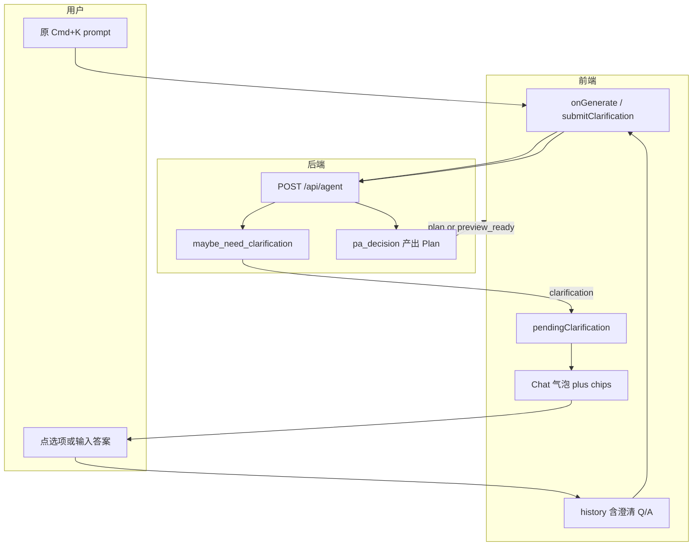
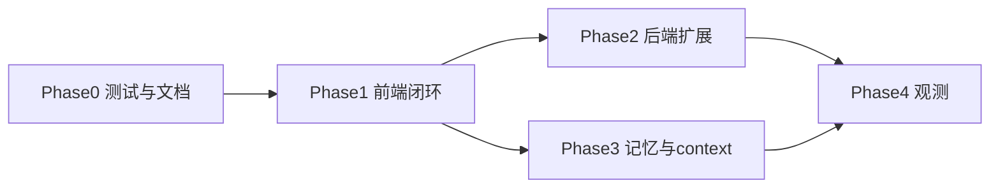

# Agent 澄清交互闭环

**相关文档：** [docs/agent-improvements.md](../../docs/agent-improvements.md) §7 · [docs/features.md](../../docs/features.md) Agent 模式 · [cursor-like_memory_blueprint_7f844b73.plan.md](cursor-like_memory_blueprint_7f844b73.plan.md) Stage 2  
**父愿景（不整单交付）：** [spreadsheet-cursor-roadmap_66f6c3b6.plan.md](spreadsheet-cursor-roadmap_66f6c3b6.plan.md)（agent-stream UI、澄清对话）

## 问题陈述

当 `/api/agent` 返回 `kind: "clarification"` 时，用户无法从 UI 判断应：

- **重输一条更完整的自然语言需求**（新 Cmd+K 任务），还是
- **直接回答模型/规则提出的具体问题**（例如选择目标表名）。

**根因：** 澄清仅出现在底部 `status` 一行；Chat 无 assistant 追问气泡；输入区与 **Generate Plan** 按钮语义不变，与 Cursor「上方追问 + 下方作答 / 点选项继续」不一致。

**目标：** 实现 Cursor 式**选项式澄清**（chips + 可选自由文本），并在回答后**自动续跑** Agent，产出 Plan 或 `preview_ready`。

## 现状（2026-06-04 复核）

| 层级 | 状态 | 位置 |
| --- | --- | --- |
| 动作模型 | 已有 | [`server/app/agent/actions.py`](../../server/app/agent/actions.py) `AskClarificationAction` |
| 规则触发 | 极窄 | [`server/app/agent/agent_helpers.py`](../../server/app/agent/agent_helpers.py) `maybe_need_clarification`：多表且 `add_column`/`transform_column` 缺 `table` |
| 接入决策 | 已有 | [`server/app/agent/pa_decision.py`](../../server/app/agent/pa_decision.py) `_finish_from_structured_plan` |
| 同步 API | 已有 | [`server/app/api/routes/agent.py`](../../server/app/api/routes/agent.py) → `{ kind, clarification: { question, options, context } }` |
| SSE | 已有 | [`server/app/agent/orchestrator.py`](../../server/app/agent/orchestrator.py) 事件 `clarification` |
| 前端解析 | 已有 | [`client/src/llm.ts`](../../client/src/llm.ts) `AgentProjectPlanResult` |
| 前端交互 | **缺失** | [`client/src/App.tsx`](../../client/src/App.tsx) 仅 `setStatus` 后 `return` |
| LLM 主动澄清 | **无** | 澄清为 Plan 产出后的确定性规则门，非模型输出 |
| `/api/plan*` | **无** | 澄清仅 Agent 路径 |
| HTTP 集成测 | **无** | 仅有 `test_pa_decision` / SSE ordering 单测 |

## 目标架构



### 交互原则（消歧义）

1. **澄清只出现在 Chat**；`status` 仅辅助短提示。
2. **有 `options` 必须渲染可点 chips**；无 options 时 placeholder 明确「直接回答上方问题」。
3. **`pendingClarification` 存在时**，主按钮 =「继续生成」，不是新任务；可选「取消并重新描述」为 v2。
4. **续跑保留原 `user_prompt` 意图**；答案写入 `history`，不把澄清当成全新 prompt 替换（除非用户显式取消 pending）。
5. **不**在澄清轮次调用 `appendChatMessagesFromPlan`（尚无 Plan）。

## 分阶段交付

### Phase 0 — 契约固化与可回归（约 0.5 天）

| 任务 | 交付 |
| --- | --- |
| HTTP 集成测 | mock 或构造两表 + 歧义 Plan → `POST /api/agent` → `kind=clarification`，`options` 为表名 |
| README | 触发条件、响应字段、与 preview lifecycle 的关系 |

**验收：** CI 可稳定断言 clarification JSON；文档可被前端实现直接引用。

**YAML todos：** `clarify-baseline-http-test`、`clarify-readme-contract`

---

### Phase 1 — 前端闭环（MVP，约 1.5–2 天）**必做**

#### 1.1 状态模型

```ts
type PendingClarification = {
  question: string;
  options?: string[] | null;
  context?: string | null;
  originalPrompt: string;
  traceId: string;
  /** 区分首次生成 vs preview revise */
  source: "generate" | "preview_revise";
};
```

- 收到 `agentRes.kind === "clarification"` → `setPendingClarification(...)`；清空 `plan` / `diff` / `pendingServerPreviewId`（按 source 决定是否保留 `previewHistory`）。

#### 1.2 Chat UI（Cursor 式）

- **Assistant 消息：** `content` = `question`；`meta.kind = "clarification"`；`context` 放在可折叠区块或第二段小字。
- **Option chips：** 渲染在气泡下方或输入区上方；`onClick` → `submitClarificationAnswer(option)`。
- **自由文本：** 同一 textarea；Enter /「继续生成」→ `submitClarificationAnswer(prompt.trim())`。

#### 1.3 续跑协议（v1，零后端改动）

```text
history' = history + [
  { role: "assistant", content: "[Clarification] " + question + (context ? "\n" + context : "") },
  { role: "user", content: answer }
]
prompt' = originalPrompt + "\n\n[Clarification]\n" + answer
```

调用现有 `requestAgentProjectPlan({ prompt: prompt', history: history', previewLifecycle: true, ... })`。

**不要用** `revisionMessage` 承载澄清（该字段语义为 preview 修订）。

#### 1.4 `onGenerate` 分流

```text
if (pendingClarification) submitClarificationAnswer(currentInputOrChip)
else existing onGenerate
```

#### 1.5 记忆

- 澄清 assistant + user 消息进入 `chatMessages`；
- 同步 `workspaceMemory.agentTranscript`（与 [cursor-like_memory_blueprint](cursor-like_memory_blueprint_7f844b73.plan.md) Stage 2 对齐）。

#### 1.6 样式

- [`client/src/styles.css`](../../client/src/styles.css)：`.clarification-chips`、`.clarification-context`、pending 时 `.prompt-compose` 修饰类。

**验收（手工 + 自动）：**

1. 两表 + 触发澄清的 prompt → Chat 见问题 + 表名 chips。
2. 点击 `Sheet2` → 返回 Plan，`transform_column`/`add_column` 带 `"table": "Sheet2"`。
3. 刷新浏览器后澄清轮次仍在 Chat（workspace memory）。
4. Vitest：`buildClarificationHistory`、`pending` 分流逻辑。

**YAML todos：** `clarify-pending-state` … `clarify-frontend-tests`

---

### Phase 2 — 后端增强（约 2–3 天，可拆分）

| 项 | 说明 |
| --- | --- |
| **扩展规则** | 多列同名、`activeTable` 缺失等；抽到 `clarification.py` 或扩展 `agent_helpers` |
| **`clarificationReply` 字段** | `AgentProjectPlanRequest` 可选字段；`initial_state_from_agent_project_request` 并入 `messages`，减少客户端 prompt 拼接漂移 |
| **LLM 主动澄清** | 方案 A：`result_type` 联合 `Plan \| ClarificationRequest`；方案 B：`ask_user` tool → `ask_clarification`；需 prompt 与 PA 测试 |
| **SSE 消费** | 最小 `consumeAgentStream`；History 技术视图展示 `clarification` 事件（与 roadmap 对齐） |

**验收：** 除多表缺 `table` 外至少 1 个新规则场景有单测；若做 API 字段则有 round-trip 测试。

**YAML todos：** `clarify-expand-rules`、`clarify-reply-api-field`、`clarify-llm-native-ask`、`clarify-sse-history-ui`

---

### Phase 3 — 记忆与上下文（约 1–2 天）

| 项 | 说明 |
| --- | --- |
| **History 来源** | `chatMessagesToAgentHistory()` 优先 `agentTranscript`（含澄清），避免仅从 chat 派生丢轮次 |
| **Selection context** | 请求带 `activeTable` / `selectedRange`（依赖 memory blueprint Stage 4），降低「this column」类澄清 |

**验收：** 选中列后「小写这一列」少触发多表澄清；长线程澄清仍在 Agent `history` 中。

**YAML todos：** `clarify-transcript-from-memory`、`clarify-selection-context`

---

### Phase 4 — 可观测性（约 0.5 天）

- `logInfo("agent_clarification", …)` / `clarification_resolved`
- History 技术视图 `mode: "agent_clarification"` 存 payload 快照

**YAML todo：** `clarify-telemetry`

---

## API 契约（保持后向兼容）

### 现有响应（不变）

```json
{
  "kind": "clarification",
  "plan": null,
  "clarification": {
    "question": "…",
    "options": ["Sheet1", "Sheet2"],
    "context": "Ambiguous steps: …"
  }
}
```

### 可选请求扩展（Phase 2）

```json
{
  "prompt": "原用户指令",
  "clarificationReply": "Sheet2",
  "clarificationTurnId": "uuid-optional"
}
```

服务端将 reply 作为 `user` 消息追加到 `state.messages`；`prompt` 仍为 `user_prompt` 主意图。

## 关键文件清单

| 区域 | 文件 |
| --- | --- |
| 规则澄清 | `server/app/agent/agent_helpers.py`（或新建 `clarification.py`） |
| 决策 | `server/app/agent/pa_decision.py` |
| API | `server/app/api/routes/agent.py`，`server/app/models/plan.py` |
| 测试 | `server/tests/test_agent_clarification_route.py`（新建），扩展 `test_pa_decision.py` |
| 前端核心 | `client/src/App.tsx`，`client/src/llm.ts` |
| 组件 | 建议 `client/src/ClarificationBubble.tsx`（chips + context） |
| 记忆 | `client/src/workspaceMemory.ts` |
| 样式 | `client/src/styles.css` |
| 文档 | `README.md`，`docs/agent-improvements.md` §7 勾选进度 |

## 不在本计划范围

- 单表 `/api/plan` 澄清（统一走 Agent）
- 完整 agent-stream 推理轨迹 UI（Phase 2 可选子集）
- 多选澄清、复杂表单式澄清（需扩展 payload schema）
- 服务端持久化澄清会话（仍客户端 `history` 驱动）

## 风险与决策记录

| 决策 | 选择 | 理由 |
| --- | --- | --- |
| 续跑 v1 是否改 API | 否，`history` + prompt 后缀 | 最快闭环；Phase 2 再加 `clarificationReply` |
| 澄清中是否保留 preview | revise 来源保留 `previewHistory`；首次生成清空 | 避免误提交旧 preview id |
| LLM 主动澄清 | Phase 2 可选 | Phase 1 规则 + chips 已可演示 Cursor 式交互 |
| 选项 UI 难点 | **低** | `options: string[]` 已有；主要为 React 状态机 |

## 与路线图关系

- 从 [spreadsheet-cursor-roadmap](spreadsheet-cursor-roadmap_66f6c3b6.plan.md) **拆出**本计划作为可闭集交付项。
- 完成 Phase 1 后可在 roadmap 勾选「clarification 事件 → Chat + 再请求」。
- [cursor-like_memory_blueprint](cursor-like_memory_blueprint_7f844b73.plan.md) Stage 2/4 与本计划 Phase 1/3 可并行，但 **澄清 transcript** 应在 Phase 1 落地，避免 memory 迁移时丢轮次。

## 建议执行顺序



**最小可交付：** Phase 0 + Phase 1（YAML 前 10 项 `pending` → `completed`）。
