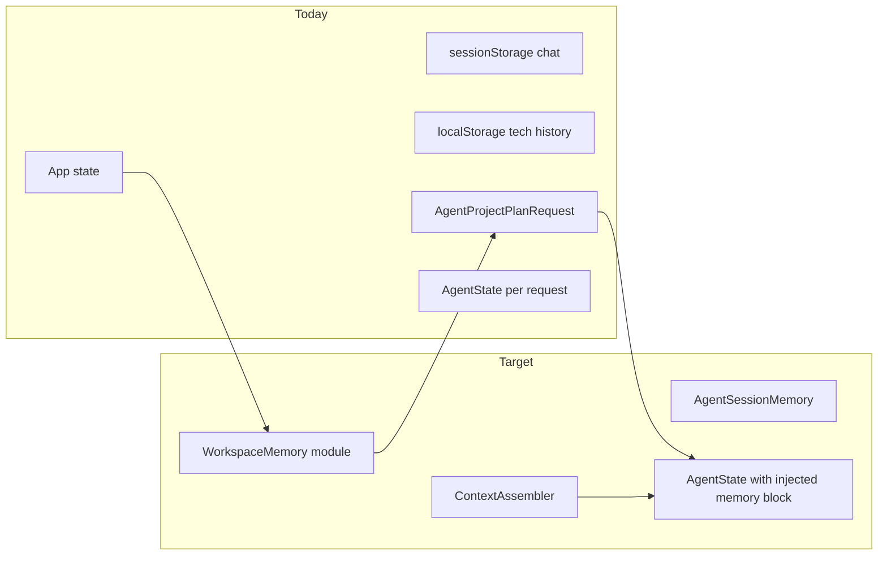
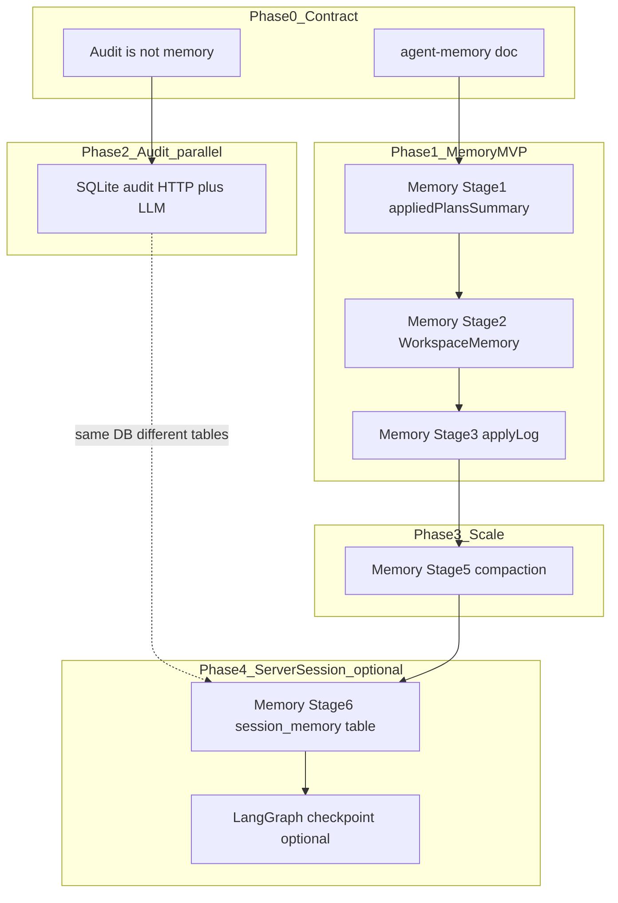
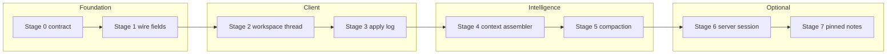

# Cursor-like memory system — staged blueprint

## Related plans and transcript lineage

| Source | Role in this blueprint |
|--------|-------------------------|
| [df908b84](df908b84-a856-4f76-957a-ffe5904aa358) | Parent thread: real-time **DB audit** (HTTP + LLM + status/errors) + merge with memory strategy + Audit/Memory/Checkpoint phasing |
| [sqlite audit plan](/Users/pawpaw/.cursor/plans/sqlite_请求审计日志_d28e8248.plan.md) | **Engineering track (Phase 2)** — satisfies “每次请求/回复/报错入库”；**not** product memory |
| [c439693a-af47-42f4-b61e-a9e6b3bc56f4](c439693a-af47-42f4-b61e-a9e6b3bc56f4) | Original Cursor-like memory blueprint discussion |
| [d1278142-1e75-4f3f-833c-b2037242009f](d1278142-1e75-4f3f-833c-b2037242009f) | **Shipped:** `workspaceKey` (builtin sample + file SHA-256), `modelTag`, dual localStorage/sessionStorage chat |

**Split from df908b84:** “数据库实时记录请求/回复/报错” → **Audit plan**. “多轮指代、同 workspace 线程、Apply 后还记得” → **this blueprint (Memory)**. Do not implement audit tables as memory or vice versa.

## North star (what “Cursor-like” means here)

Cursor’s spreadsheet analogue is **not** a vector DB on day one. It is:

| Cursor IDE pattern             | Spreadsheet MVP analogue                                                     |
| ------------------------------ | ---------------------------------------------------------------------------- |
| Per-workspace chat thread      | `[workspaceKey](client/src/workspaceHistoryStorage.ts)` + durable transcript |
| Knows what you already changed | `appliedPlansSummary` + compact **apply log**                                |
| `@` context (files, selection) | Active table, selection range, schema fingerprint                            |
| Rules in context               | Optional workspace rules blob (like `.cursor/rules` lite)                    |
| Long threads → summarization   | Turn budget + summarize old user/assistant turns                             |
| Composer sees tool trace       | Full `messages` (incl. tools), not only last 24 chat bubbles                 |

**Persistence choice (confirmed):** hybrid staged — **browser-first** early, **optional server session** later.



---

## Already shipped (do not re-plan)

From [d1278142](d1278142-1e75-4f3f-833c-b2037242009f) and [docs/client-storage.md](docs/client-storage.md):

- `BUILTIN_SAMPLE_WORKSPACE_KEY` + `hashFileToWorkspaceKey()` — stable workspace partition
- [`workspaceHistoryStorage.ts`](client/src/workspaceHistoryStorage.ts) — technical history (`conversations`, `modelTag`, plan/diff)
- [`backendSessionChatStorage.ts`](client/src/backendSessionChatStorage.ts) — chat bubbles keyed by `serverBootId` + workspaceKey
- Sample preload on startup shares the same builtin workspace key as manual load

Stage 2 **unifies** these into `WorkspaceMemory`; it does not replace audit DB or reintroduce a second chat-storage design.

## Current gaps (baseline)

Documented in [docs/client-storage.md](docs/client-storage.md) and [docs/agent-improvements.md](docs/agent-improvements.md) §6:

- **Split stores:** chat bubbles (`sessionStorage` + `serverBootId`) vs technical history (`localStorage`) vs in-memory `agentPreviewHistory` — not one Agent transcript (Stage 2 target).
- **Fragile session:** uvicorn restart clears chat keys; `history` is rebuilt from bubbles only (last 24 user/assistant), **drops tool turns**.
- **Dead fields:** `[appliedPlansSummary](server/app/models/plan.py)` / `[applied_plans_summary](server/app/models/agent_models.py)` flow into state but are **never injected** in `[decision._build_messages_dict_from_state](server/app/agent/decision.py)` or PA path (`[pa_decision.py](server/app/agent/pa_decision.py)`).
- **Wrong API:** `[fetchChatHistory](client/src/llm.ts)` → `[/api/chat-history](server/app/api/routes/chat.py)` reads **Cursor IDE** `agent-transcripts`, not spreadsheet Agent — unused in `[App.tsx](client/src/App.tsx)`.
- **No server conversation store:** `[ProjectStore](server/app/services/projects.py)` = tables only, TTL 1h.
- **No structured request audit:** stdout + optional NDJSON only; PA path unlogged — see [sqlite audit plan](/Users/pawpaw/.cursor/plans/sqlite_请求审计日志_d28e8248.plan.md) (parallel Phase 2).
- **LangGraph checkpoint:** [`get_compiled_agent_graph()`](server/app/agent/orchestrator.py) uses `compile()` **without** `checkpointer=`; multi-turn = client resend `history` / `previewHistory`, not server graph resume.

---

## Stage 0 — Memory contract (design only, ~0.5 day)

**Goal:** One written contract so later stages do not re-split storage.

Deliverable: new doc [`docs/agent-memory.md`](docs/agent-memory.md) (not `.cursor/plans/` unless you ask to save there) defining:

1. **`WorkspaceMemory`** (client, durable across refresh; keyed by `workspaceKey`)

- `chatTranscript: ChatMessage[]` (UI bubbles)
- `agentTranscript: AgentTurn[]` (what backend needs: user/assistant + optional tool summary refs)
- `applyLog: AppliedPlanEntry[]` (prompt, plan intent summary, diff columns, timestamp, modelTag)
- `previewHistory: PreviewRecord[]` (mirror current API field)
- `sessionMeta: { sessionId, lastServerBootId, schemaFingerprint }`

2. **`AgentSessionMemory`** (server, optional Stage 6): same logical fields keyed by `sessionId` or `projectId`.
2. **Injection rules:** what goes into LLM each request (ordered blocks): system → **memory block** (applied summary + last N apply log lines) → table context user message → transcript → current prompt.
3. **Deprecate:** document that `/api/chat-history` is dev/Cursor-IDE only unless repurposed.
4. **Persistence boundaries:** copy the three-way table from [Persistence & Memory Roadmap](#persistence--memory-roadmapaudit--memory--checkpoint-统一) — Memory vs Audit vs Checkpoint; link to [sqlite audit plan](/Users/pawpaw/.cursor/plans/sqlite_请求审计日志_d28e8248.plan.md).

**Acceptance:** README links to `docs/agent-memory.md`; no behavior change yet.

---

## Stage 1 — Wire existing fields (quick win, ~1–2 days)

**Goal:** Make today’s API fields actually affect the model.

### Backend

- Add `build_memory_context_block(state: AgentState) -> str` in `[server/app/agent/user_context.py](server/app/agent/user_context.py)` (or small `memory_context.py`):
  - Render `applied_plans_summary` if set.
  - Render last 3–5 items from a new optional `apply_log: list[dict]` on `AgentState` (or derive from client-sent summary only in Stage 1).
- Prepend block to system prompt in `[decision._build_messages_dict_from_state](server/app/agent/decision.py)` and PA `[system_instructions_for_state](server/app/agent/pa_state.py)` path (append after system, before transcript — same as Cursor “rules + memories” section).

### Frontend

- On **Apply** (and Agent preview **commit**), build `appliedPlansSummary` string from last K applied plans (reuse `[summarizePlanForChat](client/src/App.tsx)` / intent + step types).
- Pass `appliedPlansSummary` on every `[requestAgent](client/src/llm.ts)` call (today only `history` + `previewHistory`).

### Tests

- `server/tests/test_agent_memory_injection.py`: given state with summary, assert system/user assembly contains summary text.

**Acceptance:** User says “undo the column you added” after Apply; model sees applied summary without re-explaining grid state.

---

## Stage 2 — Unified workspace thread (browser-first, ~2–3 days)

**Goal:** One client module owns memory; chat survives **server restart** (Cursor-like “same project, new backend”).

### New module

`[client/src/workspaceMemory.ts](client/src/workspaceMemory.ts)` (name flexible):

- **Storage key:** `spreadsheet-cursor:memory:v1:<workspaceKey>` in **localStorage** (not `serverBootId`).
- Load/save debounced; migrate from:
  - [`backendSessionChatStorage.ts`](client/src/backendSessionChatStorage.ts) (import once if v1 empty)
  - optional merge of recent [`workspaceHistoryStorage`](client/src/workspaceHistoryStorage.ts) entries into `applyLog` (preserve `modelTag` on turns)
- Keep `serverBootId` only as metadata (`sessionMeta.lastServerBootId`), not partition key.
- Generate stable `sessionId` (UUID per workspace) for future `X-Session-ID` / Stage 6 sync; **do not** send plaintext `workspaceKey` to server by default (align [audit plan](/Users/pawpaw/.cursor/plans/sqlite_请求审计日志_d28e8248.plan.md)).

### App integration

- [`App.tsx`](client/src/App.tsx): replace direct `chatMessages` / dual hydration with `workspaceMemory` API.
- [`llm.ts`](client/src/llm.ts) fetch helper: keep `X-Request-ID`; add `X-Session-ID` when `sessionId` exists (audit + future session sync).
- `chatMessagesToAgentHistory()` → build from `agentTranscript` (include clarification turns; still cap count).
- History tab can keep technical payload view by reading `applyLog` + stored payloads.

### UX

- Subtle banner when `lastServerBootId !== currentBootId`: “Backend restarted; chat restored from workspace.”

**Acceptance:** Restart uvicorn → refresh browser → chat bubbles and Agent `history` still present for same `workspaceKey`.

---

## Stage 3 — Operational memory (apply log + preview lineage, ~2 days)

**Goal:** Cursor-like “what did Composer already do to this project?”

### Client

- Append to `applyLog` on every successful Apply / Agent commit:
  - `plan.intent`, step type list, `diff.addedColumns` / `modifiedColumns`, table names, ISO time.
- Maintain rolling `**appliedPlansSummary`** (≤ ~800 tokens): deterministic template, not LLM-generated in v1.

### Backend

- Extend `[AgentProjectPlanRequest](server/app/models/plan.py)` with optional `applyLog` (compact array) **or** keep client-only and only send summary (prefer summary-only first to limit payload growth).
- Merge into `AgentState` in `[initial_state_from_agent_project_request](server/app/models/agent_models.py)`.
- `[preview_history](server/app/services/agent_preview.py)`: ensure aborted/revised records surface in memory block (“pending preview X was aborted because …”).

### Cmd+K context strip (light Cursor “@ context”)

- Small read-only strip above prompt: active table, row/col selection if available, “Last apply: …” from `applyLog[0]`.

**Acceptance:** Third turn references “the join you did earlier” using apply log without full plan JSON in every request.

---

## Stage 4 — Context assembler (spreadsheet `@`, ~2–3 days)

**Goal:** Explicit, versioned **context package** per Agent call (like Cursor attaching files).

### New server helper

`assemble_agent_context(state, request_extras) -> AgentContextPackage`:

| Slice             | Source                                                                               |
| ----------------- | ------------------------------------------------------------------------------------ |
| `tables`          | existing `TableContext`                                                              |
| `selection`       | new optional fields on request: `activeTable`, `selectedRange`, `focusedColumn`      |
| `workspace_rules` | optional string from client localStorage (`spreadsheet-cursor:rules:<workspaceKey>`) |
| `memory_block`    | Stage 1–3                                                                            |
| `transcript`      | `state.messages`                                                                     |

### API

- Extend `[AgentProjectPlanRequest](server/app/models/plan.py)` with optional `context` object (Pydantic), validated once.

### Frontend

- Send AG Grid selection + active sheet name on Agent calls.
- Optional “Workspace rules” textarea in AI panel (persisted per workspace).

**Acceptance:** “Lowercase **this column**” with a column selected resolves without ambiguous clarification.

---

## Stage 5 — Compaction and budget (Cursor long-thread behavior, ~2–3 days)

**Goal:** Stable quality as transcript grows; avoid blind `slice(-24)`.

### Policy (document in `docs/agent-memory.md`)

1. **Hard caps:** max turns, max tool messages, max preview_history items (server already has revision limits).
2. **Middle-out summarization:** when over budget, replace oldest user/assistant pairs with one `system` or `user` message: “Earlier in this workspace: …” (deterministic from `applyLog` first; optional cheap LLM summary later).
3. **Tool trace:** keep last N tool rounds verbatim; older tools → one-line digest in memory block.
4. **Table context refresh:** always rebuild latest schema/sample in final user message ([`build_initial_user_message`](server/app/agent/user_context.py)), don’t rely on stale embedded schema in old turns.
5. **Forbidden input (df908b84 / audit boundary):** never compact from `llm_call_logs` or `http_request_logs`; only `agentTranscript`, `applyLog`, explicit summaries, `preview_history`.

### Implementation

- `server/app/agent/memory_compaction.py` called from orchestrator before `decision`.
- Mirror policy client-side when building `history` for non-Agent `/api/plan-project` if still used.

**Acceptance:** 30+ turn session still completes Agent call under configured token budget; tests with fixed message list assert compaction output shape.

---

## Stage 6 — Optional server session store (hybrid tier-2, ~3–5 days)

**Goal:** Multi-tab sync and backup without full DB product.

### Backend

- New `SessionStore` parallel to `[ProjectStore](server/app/services/projects.py)`:
  - Key: `sessionId` (client-generated UUID per workspace, stored in `workspaceMemory`)
  - Value: serialized `AgentSessionMemory` (transcript tail, apply log, preview_history, summaries)
  - Storage: SQLite `session_memory` table in the same DB as audit logs (see [sqlite audit plan](/Users/pawpaw/.cursor/plans/sqlite_请求审计日志_d28e8248.plan.md)); **not** file-backed JSON under `server/data/sessions/` unless audit infra is deferred.
  - TTL configurable (e.g. 7d); not Postgres for personal MVP.
- Routes: `GET/PUT /api/sessions/{sessionId}` (or piggyback on `projectId` when project API used).
- **Optional LangGraph checkpoint** (`SqliteSaver`, `thread_id` = `sessionId`): only after sync `/api/agent` and SSE share one execution path; pairs with `session_memory`, does not replace it.

### Frontend

- On hydrate: try server session if `sessionId` present; merge with local (LWW or “local wins if newer”).
- Background sync after Apply / Agent finish.

### Cleanup

- Repurpose or rename `/api/chat-history` → `GET /api/sessions/.../transcript` **or** mark old route deprecated in README to avoid Cursor-IDE confusion.

**Acceptance:** Two browser tabs same workspace see same chat after sync; clearing localStorage can restore from server within TTL.

---

## Stage 7 — “Cursor memories” lite (optional, P3)

Only after Stages 1–5 stable:

- User-pinned **workspace facts** (“`total` = price * qty”, “date column is ISO”) stored in `workspaceMemory.pinnedNotes[]`, injected in memory block.
- Optional one-shot “remember this” action on assistant message (writes pin).
- **Explicit non-goal for MVP:** embedding search over all past plans, cross-user cloud memory.

---

## Cross-cutting concerns

| Topic                  | Guidance                                                                                                                                                                                              |
| ---------------------- | ----------------------------------------------------------------------------------------------------------------------------------------------------------------------------------------------------- |
| Privacy                | Keep plaintext localStorage warning in [docs/client-storage.md](docs/client-storage.md); server session / audit DB must not log full row payloads without truncation                                  |
| Single source of truth | `AgentState.messages` = LLM truth; UI bubbles = projection of `agentTranscript`                                                                                                                       |
| Audit vs memory        | SQLite audit ([sqlite audit plan](/Users/pawpaw/.cursor/plans/sqlite_请求审计日志_d28e8248.plan.md)) = append-only debug/replay; **never** auto-inject into prompt; apply log is memory’s operational audit |
| Checkpoint vs memory   | LangGraph checkpoint = graph runtime resume; `session_memory` = compressed product session; same SQLite file, **different tables**; checkpoint is P3, after Stage 6                                   |
| LangGraph / PA         | Compaction + memory block must run before [`run_agent_orchestrated`](server/app/agent/orchestrator.py); [`pa_state.py`](server/app/agent/pa_state.py) stays adapter-only; checkpoint only after Stage 6 + unified sync/SSE |
| Docs sync              | Update [docs/features.md](docs/features.md) + [docs/agent-improvements.md](docs/agent-improvements.md) §6 per stage                                                                                   |
| Roadmap alignment      | Maps to [spreadsheet-cursor-roadmap](.cursor/plans/spreadsheet-cursor-roadmap_66f6c3b6.plan.md) **B4** (project-level Agent memory)                                                                   |

---

## Persistence & Memory Roadmap（Audit / Memory / Checkpoint 统一）

Audit、Memory、LangGraph Checkpoint 是三条线，**不是三个并行 feature**。与 [sqlite audit plan](/Users/pawpaw/.cursor/plans/sqlite_请求审计日志_d28e8248.plan.md) 对齐。

### 三者定位

| 系统                          | 存什么                    | 给谁用                    | 是否进 prompt |
| --------------------------- | ---------------------- | ---------------------- | ---------- |
| **Memory**（本蓝图 Stage 0–7）   | 压缩会话/工作区状态             | 用户续聊、模型上下文             | **是**      |
| **Audit**（独立计划，Phase 2）     | 原始 HTTP + LLM 请求/回复/错误 | 开发排障、replay            | **否**      |
| **Checkpoint**（Stage 6+ 可选） | LangGraph 图运行时状态       | 服务端 resume / interrupt | **间接**     |

### 构建阶段

| Phase | 内容                                                            | 优先级   |
| ----- | ------------------------------------------------------------- | ----- |
| **0** | `docs/agent-memory.md` 契约 + 「Audit is not memory」             | P0    |
| **1** | Memory Stage **1–3**（summary → unified thread → applyLog）     | P0–P1 |
| **2** | Audit SQLite（与 Phase 1 **并行**）                                | P0 工程 |
| **3** | Memory Stage **5** compaction（长对话痛点时）                         | P2    |
| **4** | Memory Stage **6** `session_memory` + 可选 LangGraph checkpoint | P3    |



### 同库不同表（Phase 4）

```
server/data/audit.sqlite3
├── http_request_logs / llm_call_logs   ← Audit
├── session_memory                      ← AgentSessionMemory（Stage 6）
└── langgraph checkpoints               ← optional SqliteSaver
```

### 三条铁律

1. **Memory 是产品 SSOT** — browser-first `WorkspaceMemory` 为主；Stage 6 服务端为备份/多 tab。
2. **Audit 是横切观测** — 不驱动 UI 历史，不回写 memory，不自动生成 compaction 输入。
3. **Checkpoint 是编排器基础设施** — 只在 client-resend 不够用时上（多 tab、SSE 断线续跑、多 worker）；与 preview HITL 迁移一起设计。

### 建议执行顺序

```
Week A:  Stage 0 + Stage 1 memory     ||  Audit Phase 2（并行）
Week B:  Stage 2 + Stage 3 memory
Later:   Stage 4 context assembler（按需）
Later:   Stage 5 compaction（长对话时）
Much later: Stage 6 session_memory → 再评估 checkpoint
```

**Minimum viable “feels like Cursor” + debuggable:** Stages **0 + 1 + 2 + 3** + Audit Phase 2.

---

## Suggested execution order（Memory stages only）



Note: **Audit Phase 2** runs in parallel with Stage 0–1; not shown on this roadmap diagram.

---

## Verification checklist (per release)

- Restart backend → chat + Agent follow-up still coherent (Stage 2+).
- Apply → ask referential follow-up → plan references correct column (Stage 1+).
- 25+ messages → no timeout / empty response from oversized payload (Stage 5).
- `uv run pytest server/tests/test_agent_memory_injection.py` (+ existing agent preview tests).
- **Audit parallel (Phase 2):** one `/api/agent` → `http_request_logs` + N `llm_call_logs` rows, same `trace_id` as browser `X-Request-ID`; audit rows **not** present in assembled prompt (see `test_audit_log.py` memory-boundary case when audit plan lands).
- **Regression (d127):** builtin sample + uploaded file still resolve to correct workspace history after Stage 2 migration.
