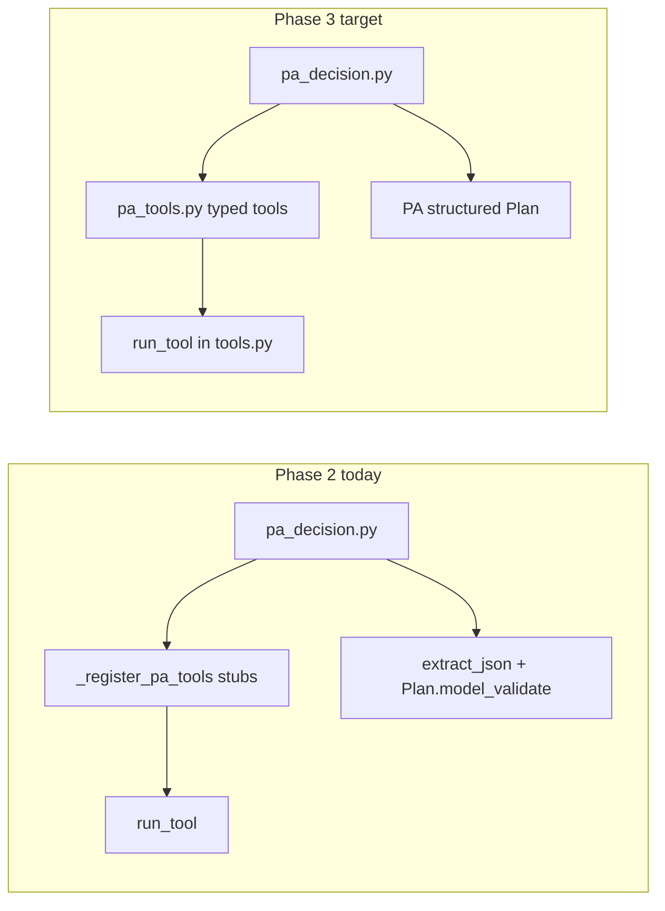

# LangGraph + Pydantic AI — Phase 3（工具与结构化 Plan）

**父计划：** [langgraph-pydantic-ai-migration.plan.md](langgraph-pydantic-ai-migration.plan.md)  
**前置：** 父计划 Phase 2 已完成（[`pa_state.py`](../../server/app/agent/pa_state.py)、[`pa_decision.py`](../../server/app/agent/pa_decision.py)、`AGENT_USE_PYDANTIC_AI` on `llm_decide`）。  
**父计划 YAML todos：** `pa-register-tools`、`pa-structured-plan-output`

## 目标

| 项 | 说明 |
| --- | --- |
| **做** | 正式 PA 工具注册（Pydantic 参数 + `RunContext[PaAgentDeps]`）；终端 Plan 用 `output_type=Plan`；统一 tool schema 来源；在 `AGENT_USE_PYDANTIC_AI=1` 下强化 `pa_decision_step` 质量与可维护性。 |
| **不做（Phase 4+）** | SSE / `stream_agent_events` 迁 PA；默认开启 flag；删除 `decision.py`；`/api/plan` 单轮 PA（Phase 5 可选）。 |

## 当前 vs 目标



## 架构约束

- **工具实现仍只在** [`server/app/services/tools.py`](server/app/services/tools.py)（`run_tool` / `_TOOL_IMPLS`）；PA 层只做类型化包装与注册。
- **Approach A 不变**：`Agent.iter()` 仍在 `CallToolsNode` 截断；本阶段不改变 LangGraph 边界。
- **HTTP `Plan`**（[`server/app/models/plan.py`](server/app/models/plan.py)）不变；`output_type=Plan` 必须产出与 `Plan.model_validate` 等价的对象。

## 交付物 1 — 类型化工具注册（`pa-register-tools`）

**新模块：** [`server/app/agent/pa_tools.py`](server/app/agent/pa_tools.py)

| 符号 | 职责 |
| --- | --- |
| `GetSchemaArgs` / `GetSampleRowsArgs` / … | 与 [`get_tools_spec_for_llm`](server/app/services/tools.py) 各 `function.parameters` 对齐的 Pydantic 模型 |
| `register_pa_agent_tools(agent, *, deps_type=PaAgentDeps)` | 注册 6 个工具，体内 `run_tool(name, args.model_dump(exclude_none=True), ctx.deps.tables)` |
| `tool_names()` | 返回注册名列表（测试与日志用） |

**参数对照表（须与 OpenAI spec 一致）：**

| 工具名 | 必填字段 | 可选字段 |
| --- | --- | --- |
| `get_schema` | — | `table_name` |
| `get_sample_rows` | — | `table_name`, `n` (默认 5, max 50 由 impl 裁剪) |
| `get_column_stats` | `table_name`, `column` | — |
| `validate_expression` | `expression` | `table_name` |
| `execute_step` | `step` (dict) | `table_name` |
| `rollback_last_step` | — | — |

**Schema 单源：**

- **首选：** 从 Pydantic 模型 `model_json_schema()` 生成 legacy `get_tools_spec_for_llm()` 条目（供未迁移的 `decision()` / 日志计数保留至 Phase 5）。
- **备选：** 共享 `TOOLS_OPENAI_SPEC` 常量，PA 与 legacy 共同读取（改动面更大时采用）。

**修改：**

- [`pa_decision.py`](server/app/agent/pa_decision.py)：`_build_pa_agent` 调用 `register_pa_agent_tools`；删除 `_register_pa_tools`。
- 可选：[`server/app/api/routes/agent.py`](server/app/api/routes/agent.py) 日志 `tools_spec_count` 改为 `len(tool_names())` 或不变。

## 交付物 2 — 结构化 Plan 输出（`pa-structured-plan-output`）

**行为变更（仅 `pa_decision_step` 无 tool call 分支）：**

1. 创建 agent 时：`create_pa_agent(..., result_type=Plan)`（或 `output_type=Plan`，与 [`llm_pydantic_ai.create_pa_agent`](server/app/services/llm_pydantic_ai.py) 参数名对齐）。
2. 在 `CallToolsNode` 截断后：
   - 若存在 `ToolCallPart` → 保持 Phase 2 `CallToolAction` 路径。
   - 若无 tool、有结构化结果 → 从 `run.result.output` 取 `Plan`（或 `AgentRunResult` 等价 API）。
3. **兜底：** `Plan.model_validate(output)` 或捕获 validation → `FinishAction(plan_validation_failed)`。
4. **澄清：** 仍调用 [`_maybe_need_clarification`](server/app/agent/decision.py)（Phase 5 再抽到 `agent/clarification.py`）。

**与 `extract_json` 的关系：**

- Phase 3 主路径不再依赖 `extract_json` + `json.loads` 解析 Plan。
- 保留 **一次** legacy 回退（env `AGENT_PA_PLAN_JSON_FALLBACK=1` 或仅在 structured 失败时），便于云端模型偶发非 schema 输出；默认关闭，测试覆盖开启路径。

**Prompt 调整：**

- [`system_instructions_for_state`](server/app/agent/pa_state.py) 可缩短 Plan JSON Schema 注入（PA `output_type` 已带 schema）；与 [`prompt_content.py`](server/app/services/prompt_content.py) 协调，避免 token 重复（见 cloud_llm ROI tier3-prompt-slim，可只做 agent 路径瘦身）。

## 测试策略

| 文件 | 内容 |
| --- | --- |
| `server/tests/test_pa_tools.py` | 各工具 mock `run_tool`；参数校验失败；`table_name` 注入 |
| `server/tests/test_pa_structured_plan.py` | TestModel / mock `Agent.iter` 返回 `Plan`；clarification、validation 失败 |
| 扩 `test_pa_decision.py` | 结构化路径取代纯 JSON 文本 mock |
| 可选 fixture | 复用 `test-data/` 或现有 `_minimal_plan_json` 模式 |

```bash
cd server && uv run pytest tests/test_pa_tools.py tests/test_pa_structured_plan.py tests/test_pa_decision.py -q
```

## 文件变更清单

| 文件 | 变更 |
| --- | --- |
| `server/app/agent/pa_tools.py` | **新建** |
| `server/app/agent/pa_decision.py` | 结构化输出 + 注册调用 |
| `server/app/services/tools.py` | 可选：导出 schema 辅助 |
| `server/tests/test_pa_*.py` | **新建 / 扩展** |

**不修改：** `orchestrator.py` 图结构、`stream_agent_events`、`/api/agent` 响应映射。

## 验收标准

1. `AGENT_USE_PYDANTIC_AI=1` 时，mock 测试覆盖 typed tools + structured Plan 终端。
2. `get_tools_spec_for_llm()` 与 PA 工具参数在名称/必填字段上一致（自动化测试或快照）。
3. 多表 `ask_clarification` 行为与 Phase 2 一致。
4. 父计划 Phase 3 两项 todo 可标 `completed`。

## 风险与缓解

| 风险 | 缓解 |
| --- | --- |
| 模型同时返回 tool + structured output | 优先 tool（与 Phase 2 一致）；文档化 |
| `output_type=Plan` 与 tools 共存配置错误 | 参考 pydantic-ai 文档；TestModel 覆盖 |
| Schema 漂移 | 单源生成 + 对比测试 |

## 完成后

- 父计划注明：**Phase 4** 负责 SSE + 默认开启 PA；**Phase 5** 负责删 legacy `decision` 与 plan 路由统一。
