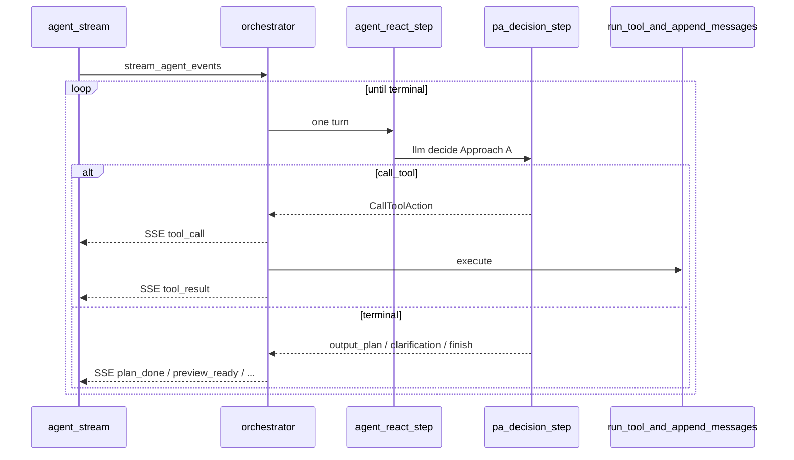

# LangGraph + Pydantic AI — Phase 4（流式与 API parity）

**父计划：** [langgraph-pydantic-ai-migration.plan.md](langgraph-pydantic-ai-migration.plan.md)  
**前置：** [Phase 3](langgraph-pa-phase-3.plan.md)（typed tools + structured `Plan` on `pa_decision_step`）  
**父计划 YAML todos：** `pa-stream-sse-mapping`、`pa-sync-api-parity`

## 2026-06-02 复核结论

| 观察 | 计划影响 |
| --- | --- |
| `run_agent_orchestrated` 的 `llm_decide` 已在 `AGENT_USE_PYDANTIC_AI` 下调用 `pa_decision_step`；`stream_agent_events` 仍直接调用 `decision()`。 | Phase 4 不需要重写同步图；主阻塞是抽共享 step，避免 sync/stream 在 PA flag 下 split-brain。 |
| `server/.env.example` 仍写着 “sync orchestrator only; SSE unchanged until Phase 4”。 | Phase 4 完成时必须同步配置说明，否则用户会误判 flag 覆盖范围。 |
| `evaluate_output_plan_preview` 已被 sync 与 SSE 共用。 | preview 修订逻辑只需保持共享 step 后的行为不变，重点测 PA 路径与事件顺序。 |
| 现有 SSE 相关测试 patch `app.agent.orchestrator.decision`。 | 改为 patch `agent_react_step` 做事件/preview 测试；另保留显式 legacy flag-off 测试。 |

## 目标

| 项 | 说明 |
| --- | --- |
| **做** | SSE [`stream_agent_events`](server/app/agent/orchestrator.py) 与同步 [`run_agent_orchestrated`](server/app/agent/orchestrator.py) 在 PA 路径下行为一致；事件名/字段/顺序与现网兼容；[`/api/agent`](server/app/api/routes/agent.py) JSON 形状不变。 |
| **不做（Phase 5）** | 删除 `decision.py`；`/api/plan` 迁 PA；架构文档大改。 |

## 现状（Phase 2 之后）

| 路径 | LLM 决策 | 工具执行 |
| --- | --- | --- |
| `run_agent_orchestrated`（图 `llm_decide`） | `pa_decision_step` if `AGENT_USE_PYDANTIC_AI` else `decision` | 图 `tool_exec` |
| `stream_agent_events` | **始终** `decision()` | `run_tool_and_append_messages` 手写循环 |

前端 [`client/src/llm.ts`](client/src/llm.ts) 主要消费 **同步** `/api/agent`（`AgentProjectPlanResult`）；`/api/agent-stream` 仍须保持契约供调试与未来 UI。当前代码的 split-brain 是：同步路径可 opt-in PA，SSE 路径固定 legacy。

## 目标架构



**实现策略：共享 imperative 步进（Phase 4 选定）**

- 新增 `async def agent_react_step(state) -> tuple[AgentState, AgentAction]`：
  - 内部调用 `pa_decision_step` 或 `decision`（由 flag 控制）。
- `stream_agent_events`：用 `agent_react_step` 替换直接 `decision()`；SSE 发射逻辑保持现位置。
- `_node_llm_decide`：改为 `agent_react_step` 薄包装（避免双份分支）。
- 暂不采用 LangGraph `astream_events`：当前 preview 修订外层循环与 SSE 事件契约更适合保留现有 imperative 发射点；父计划中的 “astream_events” 表述需同步改成 “shared ReAct step → existing `_sse`”。

## SSE 契约（不可破坏）

事件名与 `data` 字段（与 [`_sse`](server/app/agent/orchestrator.py) 一致）：

| event | 何时 | `data` 关键字段 |
| --- | --- | --- |
| `tool_call` | `CallToolAction` | `tool`, `args`, `state` |
| `tool_result` | 工具执行后 | `tool`, `state` |
| `plan_done` | `OutputPlanAction`（无 preview 或 preview 关闭） | `plan`, `state` |
| `preview_ready` | preview dry-run 成功 | `plan`, `preview`, `state` |
| `clarification` | `AskClarificationAction` | `question`, `options`, `context`, `state` |
| `finish` | `FinishAction` / cap | `reason`, `state` |

**顺序规则（测试必须断言）：**

1. 每个 tool 回合：`tool_call` 严格先于 `tool_result`。
2. 终端序列只允许一种：`plan_done`；或 `preview_ready` 后紧跟 `plan_done`；或 `clarification`；或 `finish`。
3. `state` 为 `AgentState.to_dict()` 简报，字段集不变。

## 交付物 — 同步 API parity（`pa-sync-api-parity`）

| 检查项 | 验证方式 |
| --- | --- |
| `kind=preview_ready` / `clarification` / `PlanResponse` / 422 `llm_error` | 扩展现有 agent route 测试或 mock 端到端 |
| `previewDecision` confirm/abort/revise 路径 | **不经过** graph；无变更 |
| `AGENT_USE_PYDANTIC_AI=true` 全量 agent pytest | CI job 或本地脚本 |

[`_map_agent_result_to_response`](server/app/api/routes/agent.py) **不修改**映射表；仅保证输入 `AgentAction` 来源一致。

## 测试策略

| 文件 | 内容 |
| --- | --- |
| 扩 [`test_agent_orchestrator_preview.py`](server/tests/test_agent_orchestrator_preview.py) | SSE + PA flag；preview ready/revise/cap 与 sync parity |
| 新 `server/tests/test_agent_stream_sse_order.py` | 解析 SSE；断言 tool_call/tool_result 顺序与 terminal exclusivity |
| 扩 `test_plan_wire_serialization.py` 或 agent route 测试 | `/api/agent` response shape 在 PA flag 下保持 `preview_ready` / `clarification` / `PlanResponse` 映射 |

新增/调整的关键断言：

- `AGENT_USE_PYDANTIC_AI=True` 时 `stream_agent_events` 调用 `pa_decision_step`，且 `decision` 未被调用。
- `AGENT_USE_PYDANTIC_AI=False` 时 legacy 回滚仍可走 `decision`。
- 现有 patch `app.agent.orchestrator.decision` 的 SSE 测试要么改 patch `agent_react_step`，要么显式覆盖 legacy flag-off 分支。
- preview lifecycle 下，SSE 与 sync 一样：revise 继续循环；cap 发 `finish`；ready 发 `preview_ready` 后发 `plan_done`，且 `plan` 使用 wire dict。

```bash
cd server && uv run pytest tests/test_agent_orchestrator_preview.py tests/test_agent_stream_sse_order.py -q
AGENT_USE_PYDANTIC_AI=1 uv run pytest tests/test_agent_*.py tests/test_pa_*.py -q
```

## 配置

| 项 | 说明 |
| --- | --- |
| `AGENT_USE_PYDANTIC_AI` | Phase 4 完成后仍可默认 `false`；默认切换交给 Phase 5，除非本阶段明确执行 `p4-flag-default-optional` |
| 回滚 | 设 `0` 恢复 sync + stream 均 legacy；Phase 4 完成后不应再出现 sync PA / stream legacy 的 split-brain |

## 文件变更清单

| 文件 | 变更 |
| --- | --- |
| `server/app/agent/orchestrator.py` | `agent_react_step`；`stream_agent_events`；`_node_llm_decide` 复用 |
| `server/tests/test_agent_stream_sse_order.py` | **新建** |
| `server/tests/test_agent_orchestrator_preview.py` | 扩 SSE + PA flag / preview lifecycle 测试 |
| `server/.env.example` | 更新 `AGENT_USE_PYDANTIC_AI` 说明为 sync + stream 一致 |
| `.cursor/plans/langgraph-pydantic-ai-migration.plan.md` | 父 todo 文案从 `astream_events` 改为 shared step + `_sse` |

## 验收标准

1. `AGENT_USE_PYDANTIC_AI=true`：sync + stream 均走 PA；split-brain 消除。
2. SSE ordering 测试绿；preview 修订与 Phase 2 orchestrator 测试等价。
3. 前端无需改动（同步 API 形状不变）。
4. `.env.example` 不再声称 SSE 未迁移；父计划 Phase 4 文案与实现策略一致。
5. 父计划 Phase 4 两项 todo `completed`。

## 风险与缓解

| 风险 | 缓解 |
| --- | --- |
| `astream` 与 preview 外层循环难组合 | 优先策略 A |
| SSE 双发 `plan_done` + `preview_ready` 回归 | 复制现有测试用例 |
| 默认开 PA 导致 CI 需 API key | mock 测试为主；integration marker 可选 |

## 完成后

- **Phase 5**：删 legacy、统一 plan 路由、文档。
