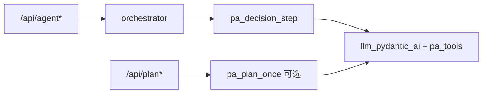

# LangGraph + Pydantic AI — Phase 5（清理与文档）

**父计划：** [langgraph-pydantic-ai-migration.plan.md](langgraph-pydantic-ai-migration.plan.md)  
**前置：** [Phase 4](langgraph-pa-phase-4.plan.md)（SSE + sync 均 PA；无 split-brain）  
**父计划 YAML todos：** `pa-optional-plan-routes`、`pa-deprecate-manual-decision`、`pa-docs-architecture`

## 目标

| 项 | 说明 |
| --- | --- |
| **做** | 单一 Agent LLM 路径（Pydantic AI）；文档反映真实架构；可选单轮 plan 与 Agent 共享 PA 校验。 |
| **可选** | `/api/plan`、`/api/plan-project` 迁 PA（非阻塞 Agent MVP）。 |
| **不做** | 改前端 Plan 类型；改 `Plan` HTTP 模型；LangGraph 大图重写。 |

## 2026-06-02 复核结论

| 观察 | 计划影响 |
| --- | --- |
| `pa_decision.py` 仍从 `decision.py` import `_maybe_need_clarification`、`_state_after_turn`、`_state_with_user_feedback`。 | Phase 5 删除 `decision.py` 前必须先抽 helper；否则 PA 主路径会被 legacy 文件牵住。 |
| `AGENT_USE_PYDANTIC_AI` 默认仍为 false；Phase 4 计划决定不在该阶段改默认值。 | Phase 5 第一项应是“Agent PA only”决策，而不是顺手改 README。 |
| `/api/plan`、`/api/plan-project` 仍走 `call_llm` + `_parse_and_validate_plan`。 | 单轮 PA plan 路由保持 optional；不影响 Agent legacy cleanup。 |
| `AGENT_PA_PLAN_JSON_FALLBACK` 是 Phase 3 为 structured Plan 缺失保留的 debug/兼容口。 | Phase 5 要明确保留为 debug-only 或删除，避免迁移完成后仍有隐藏手写 JSON 主路径。 |

## 交付物 1 — 废弃 legacy decision（`pa-deprecate-manual-decision`）

### 当前依赖面

| 消费者 | 用途 |
| --- | --- |
| [`orchestrator.stream_agent_events`](server/app/agent/orchestrator.py) | Phase 4 后应已移除 |
| [`orchestrator._node_llm_decide`](server/app/agent/orchestrator.py) | Phase 4 后应已移除 |
| [`app.agent.__init__`](server/app/agent/__init__.py) | 导出 `decision` |
| 测试 | `test_agent_message_shape.py`、`test_agent_decision_tool_json.py` |

### 目标状态



**步骤：**

1. 将 `_state_after_turn`、`_maybe_need_clarification`、`_state_with_user_feedback` 抽到 `server/app/agent/agent_helpers.py`（或 `clarification.py`），供 `pa_decision` 与测试引用。
2. 将 `run_tool_and_append_messages` 的归属明确化：
   - 若继续作为 shared ReAct tool executor，移动到 `agent_helpers.py` 或 `tool_execution.py`；
   - `orchestrator.py`、`test_agent_message_shape.py`、`test_pa_decision.py` 改 import 新位置。
3. `decision.py`：
   - **方案 A（推荐）：** 删除文件；测试改为 mock `pa_decision_step` 或测 helpers。
   - **方案 B：** 保留薄包装 `async def decision(...): return await pa_decision_step(...)` + `@deprecated` 注释，一个版本后删。
4. `app.agent.__init__`：导出 `pa_decision_step` 与 `agent_react_step`（若外部测试需要），避免生产路径再导出 legacy `decision`。
5. 移除 `AGENT_USE_PYDANTIC_AI` 分支（config 项删除或固定 true）。
6. `AGENT_PA_PLAN_JSON_FALLBACK`：
   - 若保留：只作为 debug-only，`.env.example` 与 README 明确“非默认、非生产主路径”；
   - 若删除：移除 `_finish_from_plan_text`、相关 `call_llm` retry 与测试。

### 保留的 legacy LLM

[`server/app/services/llm.py`](server/app/services/llm.py) 的 `call_llm` **仍保留**给：

- Phase 5 完成前的 plan 路由（若未做 optional 项）；
- `pa_decision` 内 Plan JSON retry 回退（若 Phase 3 保留 fallback）；
- 其他非 Agent 调用方。

`call_llm_with_tools`：Agent 路径无引用后可标 `@deprecated` 或删除（先 `rg call_llm_with_tools`）。若 `/api/plan*` 未迁 PA，`call_llm` 仍保留。

## 交付物 2 — 可选 plan 路由（`pa-optional-plan-routes`）

**新模块（建议）：** `server/app/services/pa_plan.py`

```python
async def generate_plan_once(
    *,
    model_source: str,
    system_prompt: str,
    user_content: str,
    cloud_model_id: str | None = None,
    local_model_id: str | None = None,
) -> Plan:
    """单轮 PA，无 tools，result_type=Plan。"""
```

**修改：**

- [`server/app/api/routes/plan.py`](server/app/api/routes/plan.py)：`POST /api/plan`、`/api/plan-project`（及 by-id 变体）在 flag `PLAN_USE_PYDANTIC_AI` 或复用 `AGENT_USE_PYDANTIC_AI` 时调用 `generate_plan_once`。
- 复用 [`_parse_and_validate_plan`](server/app/api/routes/plan.py) 的 retry 语义或委托 PA `retries`。
- 测试：mock PA；对比现有 plan JSON fixture。

**取舍建议：** 若 Phase 5 目标是快速完成 Agent migration，可将 `p5-optional-plan-routes` / 父计划 `pa-optional-plan-routes` 标 `cancelled`，并在父计划 Status 写明「plan 路由仍用 `call_llm` + `_parse_and_validate_plan`，不属于 Agent runtime」。只有在需要统一 LLM telemetry、structured output 或删除 `call_llm` 主路径时才实施。

## 交付物 3 — 文档（`pa-docs-architecture`）

更新 [`docs/architecture.md`](docs/architecture.md)：

| 小节 | 内容 |
| --- | --- |
| Backend `agent/` | `orchestrator`（LangGraph）、`pa_decision`、`pa_state`、`pa_tools`、`actions` |
| LLM | `llm_pydantic_ai`（OpenRouter/Ollama）、与 `llm.py` 关系 |
| 流式 | `/api/agent-stream` 事件表（链到 agent-preview-lifecycle） |
| 配置 | `AGENT_USE_PYDANTIC_AI` 已删除/固定；`AGENT_PA_PLAN_JSON_FALLBACK` 的最终状态 |

更新 [`README.md`](README.md)：

- Agent 默认栈：LangGraph + Pydantic AI；
- 本地开发：仅需现有 OpenRouter/Ollama env；
- 测试命令：`uv run pytest tests/test_pa_*.py tests/test_agent_*.py`。

**不恢复** `docs/goals.md`（workspace 规则禁止）。

## 测试与验收

```bash
cd server && uv run pytest -q
```

| 标准 | 说明 |
| --- | --- |
| 无 `from app.agent.decision import decision` 在生产路径 | `rg` 验证 |
| `pa_decision.py` 不再从 `decision.py` 导入 helper | helper 已迁移并有测试 |
| `AGENT_USE_PYDANTIC_AI` 无 runtime 分支 | `rg AGENT_USE_PYDANTIC_AI` 只剩文档历史或完全无结果 |
| Agent 全套测试绿 | 含 message shape、preview、orchestrator |
| 文档链接有效 | architecture ↔ orchestrator 文件存在 |

## 文件变更清单

| 文件 | 变更 |
| --- | --- |
| `server/app/agent/agent_helpers.py` | **新建**（从 decision 抽出） |
| `server/app/agent/decision.py` | 删除或 shim |
| `server/app/agent/__init__.py` | 导出更新 |
| `server/app/config.py` | 移除 opt-in flag |
| `server/.env.example` | 移除或更新 `AGENT_USE_PYDANTIC_AI` / `AGENT_PA_PLAN_JSON_FALLBACK` |
| `server/app/services/pa_plan.py` | 可选新建 |
| `server/app/api/routes/plan.py` | 可选 PA |
| `docs/architecture.md`, `README.md` | 更新 |
| `.cursor/plans/langgraph-pydantic-ai-migration.plan.md` | Status：迁移完成 |

## 风险与缓解

| 风险 | 缓解 |
| --- | --- |
| 删除 decision 破坏外部导入 | grep + 保留一个版本 shim |
| plan 路由迁 PA 行为差异 | A/B fixture；保留 call_llm 开关一周 |
| 文档过时 | 与 Phase 5 同 PR |

## 父计划收尾

全部 Phase 0–5 todos `completed` 后，[langgraph-pydantic-ai-migration.plan.md](langgraph-pydantic-ai-migration.plan.md) 可移至 INDEX「已完成」表或保留作历史参考；**子计划** phase-3/4/5 文件保留链接供审计。
