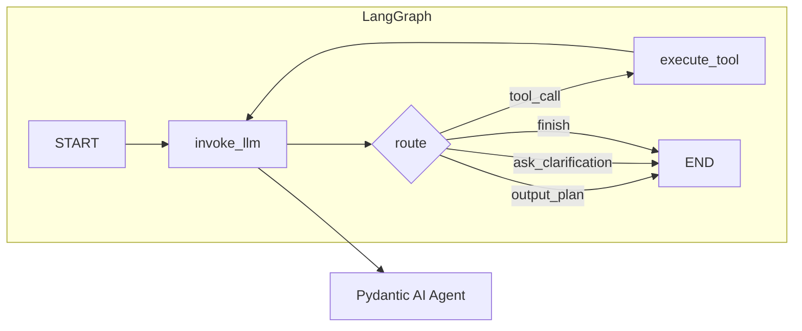

# LangGraph + Pydantic AI migration

## Todo checklist (YAML source of truth)

Mirror of frontmatter `todos`; update **YAML `status` first**, then check boxes here. **Phase 0** is done (LangGraph live); **Phases 1–5** are the Pydantic AI rollout (not scheduled — future work).

### Phase 0 — LangGraph foundation (completed)

- [x] LangGraph orchestration in `orchestrator.py` → `/api/agent`, `/api/agent-stream` (`lg-orchestrator-shipped`)
- [x] `langgraph` in `server/pyproject.toml` (`lg-dep-installed`)

### Phase 1 — Dependencies and PA model layer

- [x] Add `pydantic-ai` dep; `uv sync` + import smoke (`pa-dep-pydantic-ai`)
- [x] OpenRouter/Ollama PA factory (`pa-openrouter-ollama-wrapper`)

### Phase 2 — Graph nodes and state

- [x] `invoke_llm` + `execute_tool` nodes with Pydantic AI, Approach A (`pa-approach-a-nodes`) — `pa_decision.py` + `AGENT_USE_PYDANTIC_AI` on shared `agent_react_step` (sync + SSE)
- [x] State adapters + message/history semantics (`pa-state-adapters`) — `pa_state.py`

### Phase 3 — Tools and structured Plan

- [x] Register `tools.py` with Pydantic models + state injection (`pa-register-tools`) — [`pa_tools.py`](../../server/app/agent/pa_tools.py)；`get_tools_spec_for_llm` 委托 `build_openai_tools_spec`
- [x] `result_type=Plan` structured output + tests (`pa-structured-plan-output`) — `final_result` 分区 + `test_pa_structured_plan.py`

### Phase 4 — Streaming and API parity

- [x] Shared ReAct step + SSE event mapping/order tests (`pa-stream-sse-mapping`) — `agent_react_step` + `test_agent_stream_sse_order.py`
- [x] Non-stream `/api/agent` shape parity (`pa-sync-api-parity`) — 映射未改；现有 wire/预览测试通过

### Phase 5 — Optional cleanup and docs

- [~] (Optional) Unify `/api/plan`, `/api/plan-project` on PA (`pa-optional-plan-routes`) — **cancelled**；plan 路由仍用 `call_llm`
- [x] Extract helpers, delete `decision.py` (`pa-deprecate-manual-decision`) — `agent_helpers.py` + PA-only `agent_react_step`
- [x] Architecture docs (`pa-docs-architecture`) — `docs/architecture.md`, README

## Goals

- **LangGraph**: graph state, nodes (LLM, tool execution, clarification routing), conditional edges, streaming aligned with `/api/agent-stream`.
- **Pydantic AI**: tool registration, structured output / `result_type` for `Plan`, retries where the framework helps.
- **Keep**: Pydantic models in `server/app/models/` for HTTP and `Plan`; OpenRouter/Ollama configuration from `config.py`.

## Status (2026-06-02)

- **迁移完成（Phase 0–5）**：Agent 生产路径为 LangGraph `orchestrator` + Pydantic AI `pa_decision_step`（sync 与 SSE 共用 `agent_react_step`）。`decision.py` 与 `AGENT_USE_PYDANTIC_AI` 已移除。
- **Helpers**：[`agent_helpers.py`](../../server/app/agent/agent_helpers.py)（澄清、轮次、`run_tool_and_append_messages`）。
- **Plan 路由**：`/api/plan*` 仍用 `call_llm` + JSON 提取（未迁 PA；见 `pa-optional-plan-routes` cancelled）。
- **Debug**：`AGENT_PA_PLAN_JSON_FALLBACK=1` 仅在 structured Plan 缺失时解析 assistant 文本（非默认生产路径）。

## Current architecture (before Pydantic AI)

- **Agent**: `decision()` 由 LangGraph `plan_generator` 节点调用；`AgentState` in `state.py`, actions in `actions.py`.
- **LLM**: `server/app/services/llm.py` — `call_llm` / `call_llm_with_tools`.
- **Tools**: `server/app/services/tools.py` — JSON schema + `run_tool`.
- **Plan**: `Plan.model_validate` after JSON extraction.
- **API**: `/api/plan`, `/api/plan-project`; `/api/agent`, `/api/agent-stream` must stay compatible.

## Target architecture

| Layer            | Before                              | After                                                                                  |
| ---------------- | ----------------------------------- | -------------------------------------------------------------------------------------- |
| Orchestration    | `run_agent_loop` + `decision()`     | LangGraph `StateGraph`: decision node ↔ tool node with conditional edges               |
| LLM + validation | Manual JSON + `Plan.model_validate` | Pydantic AI agent with tools + structured `Plan` (or hybrid: PA single step, LG loops) |
| State            | dataclass `AgentState`              | `TypedDict` or Pydantic state for LangGraph reducers (e.g. `messages`)                 |
| API models       | Pydantic                            | **Unchanged** (`plan.py`, `chat.py`, request/response types)                           |

## Dependencies and layout

- **Deps** (e.g. `pyproject.toml`): `langgraph`, `pydantic-ai`; keep `pydantic`, `httpx`.
- **Suggested modules**:
  - `server/app/graph/` — compiled graph, state schema, streaming entry (alternative: `server/app/agent/graph.py`).
  - `server/app/agent/` — thin Pydantic AI agent factory used by graph nodes.
  - `server/app/services/` — keep `tools.py` implementations; register tools with Pydantic AI.

## Graph design

- **State** (map from `AgentState`): `tables`, `messages`, `applied_plans_summary`, `current_turn`, `max_turns`, `user_prompt`, model ids, plus `last_action` / `pending_tool_call` for routing.
- **Nodes**:
  1. **invoke_llm** — run Pydantic AI (tools + optional `result_type=Plan`); set `last_action` and tool payload.
  2. **execute_tool** — `run_tool`, append assistant/tool messages, increment turn, clear pending call.
- **Edges**: `START → invoke_llm`; conditional on `last_action` to `execute_tool` or `END`.
- **Streaming**: shared ReAct step mapped to existing SSE: `tool_call`, `tool_result`, `preview_ready`, `plan_done`, `clarification`, `finish`.

## Pydantic AI integration

- **Approach A (recommended for SSE parity)**: each PA call is one “step”; tool calls return to LangGraph’s `execute_tool`, then back to `invoke_llm` — matches today’s per-step events.
- **Approach B**: PA runs an inner multi-tool loop; LangGraph only wraps “run agent once”; streaming depends on PA’s APIs.
- Register tools from `tools.py` with Pydantic parameter models; inject `tables` from graph state.
- Provide OpenRouter/Ollama via OpenAI-compatible model config or custom transport.

## API routes

- `**/api/agent`**: build initial state → `graph.ainvoke` / `invoke` → map final state to `PlanResponse` / clarification / errors (same shapes as today).
- `**/api/agent-stream**`: stream graph events → existing `_sse` format.
- `**/api/plan`, `/api/plan-project**` (optional later): single-shot PA run with `result_type=Plan` for shared validation.

## Implementation order

Maps to **Todo checklist** phases 1–5 (phase 0 = LangGraph already shipped).

1. **Phase 1** — Add deps; PA model wrapper for OpenRouter/Ollama.
2. **Phase 2** — Define graph state + `invoke_llm` / `execute_tool` + compile; non-stream parity with current orchestrator.
3. **Phase 3** — Migrate tools to PA registration; inject state; structured `Plan` output.
4. **Phase 4** — Wire `/api/agent-stream` to the shared ReAct step (SSE mapping + ordering tests).
5. **Phase 5** — Extract helpers, optionally unify single-turn plan routes on PA, remove or narrow legacy `decision` / manual JSON, document architecture.

## File change checklist (indicative)

| File                                                    | Change                                       |
| ------------------------------------------------------- | -------------------------------------------- |
| `server/pyproject.toml`                                 | add `langgraph`, `pydantic-ai`               |
| `server/app/agent/state.py`                             | LangGraph state + `initial_state_*` adapters |
| New `server/app/agent/graph.py` or `server/app/graph/`  | `StateGraph`, nodes, `build_agent_graph()`   |
| New `server/app/services/llm_pydantic_ai.py` (optional) | PA calls used by decision node               |
| `server/app/agent/decision.py`                          | deprecate loop; or thin wrapper over graph   |
| `server/app/api/routes/agent.py`                        | invoke / astream graph                       |
| `FEATURES.md` / `AGENT_IMPROVEMENTS.md`                 | document architecture                        |

## Risks

- PA + custom Ollama/OpenRouter endpoints may need extra adapter work; fallback is LG nodes still calling `llm.py` with PA only for schemas/tools.
- SSE ordering must match node boundaries; add explicit mapping tests.
- Preserve `messages` / history semantics for `initial_state_from_agent_project_request`.

