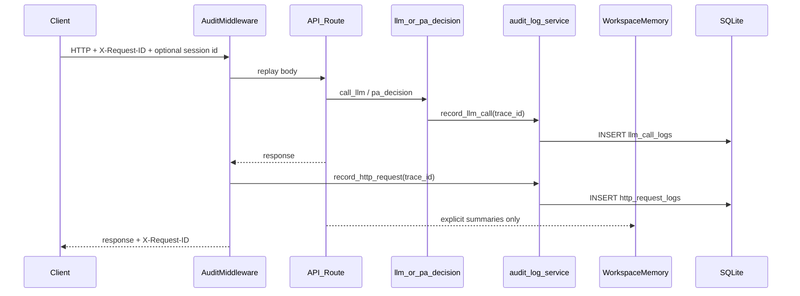
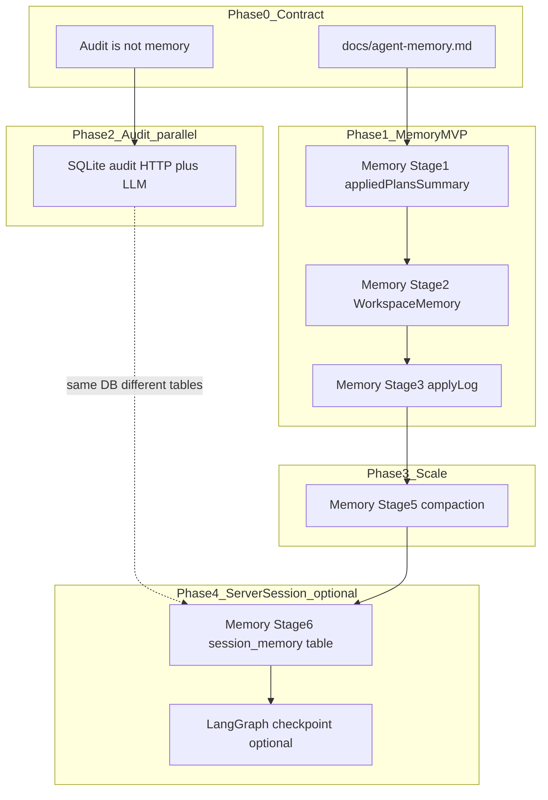

# SQLite 请求审计日志 + Memory 策略对齐

## 整体 Review

本计划需要同时吸收两条历史线索：

- [Workspace chat local cache](d1278142-1e75-4f3f-833c-b2037242009f)：已明确用内置 sample key + 上传文件 SHA-256 `workspaceKey` 做浏览器本地对话缓存，并在每轮记录 `modelTag`（如 `cloud-Auto`）。这解决的是“用户/调试时的应用内历史”，不是服务端审计。
- [Cursor-like memory blueprint](c439693a-af47-42f4-b61e-a9e6b3bc56f4)：定义 browser-first → server session 的分阶段 memory 路线。核心原则是 `WorkspaceMemory` / `AgentSessionMemory` 是压缩产品状态，审计日志是事实记录。

当前审计计划与这两条线不冲突，但必须明确边界和衔接：

- `[RequestLoggingMiddleware](server/app/main.py)` 现在只把 HTTP 起止写到 stdout；`[log_llm_call](server/app/services/llm_debug_log.py)` 只覆盖 `call_llm` / `call_llm_with_tools`，并且仅在 `LLM_DEBUG_LOG_DIR` 开启时写 NDJSON；`[pa_decision_step](server/app/agent/pa_decision.py)` 的 Pydantic AI 主路径没有结构化审计。
- 已有本地缓存策略是 **workspaceKey browser-first**：示例表格使用固定键（`workspace:builtin:sample-xlsx`），上传文件使用内容 SHA-256，`chatMessages` / `conversations` / `modelTag` 保存在浏览器本地。
- 当前 memory 蓝图（`[cursor-like_memory_blueprint_7f844b73.plan.md](../../Code/spreadsheet-cursor-mvp/.cursor/plans/cursor-like_memory_blueprint_7f844b73.plan.md)`）是 **browser-first**：`WorkspaceMemory` 先在客户端 `localStorage` 聚合 transcript / apply log / preview history，再把压缩后的 `appliedPlansSummary` 注入 Agent prompt。
- 新的 SQLite 审计库应定位为 **事实记录与排障库**，不是 prompt memory 的直接来源。否则会把完整请求体、表格样本、失败回复、工具中间态原样带入后续模型上下文，增加隐私、噪声与 token 风险。
- memory 蓝图 Stage 6 原计划用 `server/data/sessions/` JSON 文件做可选 server session。引入 SQLite 后，可把后续 `AgentSessionMemory` 放到同一个 SQLite 基础设施中，但必须使用独立 `session_memory` 表，不从审计表反推业务 memory。

结论：本计划先落地 SQLite 审计双写；同时预留 `session_id` / `workspace_key_hash` / `project_id` / `model_tag` 关联字段，为后续 memory Stage 2-6 服务，但不改变当前 browser-first memory 路线，也不要求把明文 `workspaceKey` 发送到后端。

## 目标架构




两层审计表、同一 `trace_id`；一次 `/api/agent` 可能产生 1 条 HTTP 记录 + N 条 LLM 记录（多轮 ReAct）。Memory 只消费显式设计的摘要字段，例如 `appliedPlansSummary`、`applyLog`、`previewHistory`，不自动读取审计日志。

## 与本地对话缓存计划的衔接

- **示例表格预加载**：`d127...` 已确认启动自动 `fetchSampleTablesWithRetry` 与手动加载示例都使用同一内置 workspace key。审计层不需要知道明文 key；HTTP 记录只需把 `/api/load-sample` 分类为 `request_kind="load_sample"`，必要时记录 `workspace_kind="builtin_sample"`。
- **上传文件**：浏览器本地用文件 SHA-256 关联历史；审计层不应记录上传二进制内容，也不应默认要求客户端上传明文 `workspaceKey`。`/api/import-file` 只记 metadata、status、project_id、文件名/类型/大小（若现有 request 可取），不记文件 bytes。
- **模型标签**：本地历史已有 `modelTag`（如 `cloud-Auto`）。服务端审计表仍以 `model_source` + `model` 为权威；可增加 nullable `model_tag` 作为前端展示标签快照，但不依赖它判断真实上游模型。
- **trace 关联**：继续以 `X-Request-ID` / `trace_id` 关联浏览器 console、HTTP 审计、LLM 审计。若未来 `WorkspaceMemory` 引入 `sessionId`，再通过 `X-Session-ID` 或 request body 传入，写入 `session_id`。
- **本地缓存不迁移进审计库**：`workspaceHistoryStorage` / `backendSessionChatStorage` 仍负责 UI 恢复；SQLite audit 不替代它们，也不驱动历史面板。

## Memory 对齐原则

- **审计日志不是 memory**：`http_request_logs` / `llm_call_logs` 保留原始请求、回复、报错与状态，用于 debug、回放和成本/质量分析；它们默认不参与 prompt 注入。
- **Memory 是压缩后的产品状态**：继续以 `WorkspaceMemory` / `AgentSessionMemory` 为边界，保存 chat transcript、agent transcript、apply log、preview history、rolling summary。
- **关联但不耦合**：审计表记录 `trace_id`、`project_id`、可选 `session_id`、可选 `workspace_key_hash`，方便从一次 Agent 交互追踪到 memory 状态，但不会把 memory schema 嵌进每条审计记录。
- **隐私默认保守**：客户端若发送 `workspaceKey`，服务端只保存 hash（例如 `sha256(workspaceKey)`），避免把本地文件 hash / 用户自定义 workspace id 作为明文审计维度。
- **未来 Stage 6 调整**：服务端 session store 不再优先使用 `server/data/sessions/*.json` 文件；应复用 SQLite 连接管理，新建 `session_memory` 表，保存压缩 memory 文档与版本号。

## Persistence & Memory Roadmap（与 Memory 蓝图统一）

Audit、Memory、LangGraph Checkpoint 是三条线，**不是三个并行 feature**。统一组织如下。

### 三者定位


| 系统                  | 存什么                                              | 给谁用                               | 是否进 prompt    |
| ------------------- | ------------------------------------------------ | --------------------------------- | ------------- |
| **Memory**          | 压缩会话/工作区状态（transcript、apply log、preview、summary） | 用户续聊、模型上下文                        | **是**（显式摘要）   |
| **Audit**（本计划）      | 原始 HTTP + LLM 请求/回复/错误                           | 开发排障、replay、成本分析                  | **否**         |
| **Checkpoint**（未启用） | LangGraph 图运行时状态（`agent` + `scratch`，按 node）     | 服务端 resume / interrupt / 多 worker | **间接**（恢复运行态） |


### 构建阶段与优先级




| 优先级    | 做什么                                | 估时     | 依赖                          |
| ------ | ---------------------------------- | ------ | --------------------------- |
| **P0** | Memory Stage 0 契约 + Stage 1 接线     | 1–2 天  | 无                           |
| **P0** | Audit SQLite（本计划）                  | 2–4 天  | 可与 Stage 1 **并行**           |
| **P1** | Memory Stage 2 统一 workspace thread | 2–3 天  | Stage 1                     |
| **P1** | Memory Stage 3 applyLog            | 2 天    | Stage 2 + preview lifecycle |
| **P2** | Memory Stage 5 compaction          | 2–3 天  | Stage 3 或 payload 成为瓶颈时     |
| **P3** | Memory Stage 6 `session_memory`    | 3–5 天  | Stage 2–3 稳定；Audit DB 已存在更顺 |
| **P3** | LangGraph checkpoint               | +2–5 天 | Stage 6 + 统一 sync/SSE 路径    |


**Checkpoint 排最后**：当前 MVP 用 client-resend（`history` / `previewHistory` 每请求重放；preview abort/confirm/revise 在路由层短路）。过早加 `checkpointer=` 但客户端仍全量重发，收益很小。

### 同库不同表（Phase 4 终态）

```
server/data/audit.sqlite3（或统一 persistence DB）
├── http_request_logs / llm_call_logs   ← Audit（Phase 2，本计划）
├── session_memory                      ← 产品 memory（Memory Stage 6）
└── langgraph checkpoints               ← LangGraph SqliteSaver（可选，Stage 6+）
```

- `**session_memory**`：给用户/多 tab 的压缩会话（transcript 摘要、apply log）
- **checkpoints**：给编排器的图中间态（停在哪个 node、从哪 resume）
- **audit tables**：只读事实链，**不回写** memory，**不自动**生成 compaction 输入

### 三条铁律

1. **Memory 是产品 SSOT** — 用户可见历史、模型该记住的压缩事实，由 `WorkspaceMemory` / `session_memory` 决定；audit 只读。
2. **Audit 是横切观测** — 每个 HTTP/LLM 调用 best-effort 落库；`trace_id` 串浏览器 console、stdout、DB；与 memory stage 无关，开发期就应存在。
3. **Checkpoint 是编排器基础设施** — 只在「服务端持有 thread、客户端不再全量重放」时启用；与 preview HITL 迁移（路由层 → graph interrupt）一起设计。

### 建议执行顺序（个人 MVP）

```
Week A:  Memory Stage 0 + Stage 1     ||  Audit Phase 2（并行）
Week B:  Memory Stage 2 + Stage 3
Later:   Memory Stage 5（长对话痛点时）
Much later: Stage 6 session_memory → 再评估 checkpoint
```

**最小「像 Cursor + 能 debug」**：Memory **0+1+2** + Audit。详见 [cursor-like_memory_blueprint_7f844b73.plan.md](../../Code/spreadsheet-cursor-mvp/.cursor/plans/cursor-like_memory_blueprint_7f844b73.plan.md) 同一节。

## 数据模型（SQLite）

新建 `[server/app/services/audit_db.py](server/app/services/audit_db.py)`：

`**http_request_logs`**

- `id` INTEGER PK
- `trace_id` TEXT NOT NULL, indexed
- `project_id` TEXT nullable, indexed（从 body/path 提取）
- `session_id` TEXT nullable, indexed（后续 WorkspaceMemory/AgentSessionMemory 使用）
- `workspace_key_hash` TEXT nullable, indexed（若客户端提供 `X-Workspace-Key`，只存 hash）
- `workspace_kind` TEXT nullable — `builtin_sample` | `uploaded_file` | `unknown`
- `model_tag` TEXT nullable（前端展示标签快照，可选）
- `method`, `path` TEXT
- `query_params` JSON (nullable)
- `request_body` JSON/TEXT (nullable, 截断)
- `response_status` INTEGER
- `response_body` JSON/TEXT (nullable, 截断)
- `error_detail` TEXT (nullable，含未捕获异常或 HTTPException detail)
- `duration_ms` REAL
- `client_host` TEXT
- `request_kind` TEXT nullable — `plan` | `agent` | `execute` | `load_sample` | `import` | `export` | `health`
- `created_at` TEXT (UTC ISO)

`**llm_call_logs`**

- `id` INTEGER PK
- `trace_id` TEXT NOT NULL, indexed
- `project_id` TEXT nullable, indexed
- `session_id` TEXT nullable, indexed
- `call_kind` TEXT — `plain` | `with_tools` | `pa_turn`
- `model_source`, `model` TEXT
- `model_tag` TEXT nullable（若前端传入或可由请求上下文推断）
- `messages` JSON (截断后的 messages)
- `tools` JSON (nullable, tool name 列表)
- `result` JSON (nullable — content / tool_calls / structured plan summary)
- `error` JSON (nullable — `{type, message}`)
- `duration_ms` REAL
- `created_at` TEXT

**后续 `session_memory`（不在本阶段实现，但预留同库）**

- `session_id` TEXT PK
- `workspace_key_hash` TEXT indexed
- `project_id` TEXT nullable, indexed
- `version` INTEGER
- `memory_json` JSON — `AgentSessionMemory` 压缩文档，不含完整原始 LLM 请求/回复
- `updated_at` TEXT
- `expires_at` TEXT nullable

启动时在 lifespan 中 `create_all`（MVP 不做 Alembic；表结构变更时手动删库或后续再加迁移）。

## 配置

在 `[server/app/config.py](server/app/config.py)` 与 `[.env.example](server/.env.example)` 增加：

- `AUDIT_DB_ENABLED=1`：`0` 关闭全部 DB 写入。
- `AUDIT_DB_PATH=server/data/audit.sqlite3`：SQLite 文件路径。
- `AUDIT_MAX_BODY_CHARS=50000`：HTTP/LLM body 截断上限（与现有 `LLM_DEBUG_MAX_CHARS` 对齐）。
- `AUDIT_STORE_WORKSPACE_KEY=0`：默认不存明文 workspace key；本计划不建议开启。若后续确有调试需要，也优先存 hash。
- `SESSION_MEMORY_DB_ENABLED=0`：预留给 memory Stage 6，本阶段不启用。

`.gitignore` 增加 `server/data/` 或 `audit.sqlite3`，避免提交含表格数据的审计库。

## 依赖

`[server/pyproject.toml](server/pyproject.toml)` 增加：

- `sqlalchemy[asyncio]>=2.0`
- `aiosqlite>=0.20`

使用 SQLAlchemy 2.0 async + `aiosqlite`；与 FastAPI async 栈一致。

## 核心服务层

新建 `[server/app/services/audit_log.py](server/app/services/audit_log.py)`：

- `init_audit_db()` / `close_audit_db()` — lifespan 调用
- `record_http_request(...)` — best-effort，`asyncio.create_task` 异步写入，**永不 raise**
- `record_llm_call(...)` — 与现有 `log_llm_call` 字段对齐，同时写 DB
- `extract_audit_context(request/body)` — 从 header/body/path 提取 `trace_id`、`project_id`、`session_id`、`model_tag`、`workspace_kind`；仅在未来明确发送 workspace key 时计算 `workspace_key_hash`

**复用** `[llm_debug_log.py](server/app/services/llm_debug_log.py)` 的 `prepare_messages_for_log`、`build_result_payload`、`build_error_payload`、`tool_names_from_spec`，避免两套截断逻辑。

**整合 NDJSON 文件日志**：`log_llm_call` 改为先调 `record_llm_call`（DB），再保留原有 `append_record`（文件，仅当 `LLM_DEBUG_LOG_DIR` 设置时）。HTTP 层只写 DB，不写 NDJSON。

**禁止行为**：不要在 `record_llm_call` 中更新 `WorkspaceMemory` / `AgentSessionMemory`；memory 更新只能发生在明确的 Apply / Agent commit / session sync 路径。

## HTTP 中间件改造

扩展 `[RequestLoggingMiddleware](server/app/main.py)`（或紧邻的新 middleware）：

1. **读 request body 并重放** — `body = await request.body()` + 自定义 `receive()`，避免消费后路由读不到 body。
2. **捕获 response body** — 迭代 `response.body_iterator` 拼接后重建 `Response`；StreamingResponse（`/api/agent-stream`）只记 `response_kind: "sse"` + status，不缓冲流内容。
3. **上下文 header**：接受可选 `X-Session-ID`。`X-Workspace-Key` 只作为未来扩展，默认客户端不发送；若后续发送，服务端只保存 hash，缺失不阻塞审计。
4. **路由策略**：
  - **跳过 body**：`/health`（仅记 metadata）。
  - **示例加载**：`/api/load-sample` 记 `request_kind="load_sample"` + `workspace_kind="builtin_sample"`，覆盖调试时自动预加载与手动加载示例的排障需求。
  - **只记 metadata**：`/api/import-file`（multipart 二进制）、`/api/export-excel`（xlsx 响应）。
  - **其余 `/api/*`**：记 JSON body（Pydantic 解析失败则存 raw string）。
  - **memory sync 路由（未来）**：只记 metadata + session id，不记录完整 `memory_json`，避免重复存储和泄露 prompt 历史。
5. **异常路径**：`except` 分支记 `error_detail` + 500；与现有 exception handler 共存。
6. **写入时机**：响应发送前/后通过 `create_task(record_http_request(...))` 落库。

## Client / Memory 最小配合

本阶段不重写 memory，但需要加两个低风险连接点：

- `[client/src/llm.ts](../../Code/spreadsheet-cursor-mvp/client/src/llm.ts)` 的统一 fetch helper 保持 `X-Request-ID`；后续如 Stage 2 引入 `workspaceMemory.sessionId`，在同一 helper 中附加 `X-Session-ID`。
- 若需要 workspace 级排障，优先发送 `X-Session-ID` 或服务端可识别的 `projectId`。不默认发送 `X-Workspace-Key`，避免把本地文件 hash / 自定义 workspace id 扩大到服务端。
- 已有 `modelTag` 继续服务 UI 历史；审计 DB 可记录同名字段，但真实模型仍以服务端 `model_source` / `model` 为准。
- `[client/src/workspaceHistoryStorage.ts](../../Code/spreadsheet-cursor-mvp/client/src/workspaceHistoryStorage.ts)` 与 future `workspaceMemory.ts` 仍是用户可见 memory 的来源；审计 DB 不驱动 UI 历史。

## LLM 埋点

### Plan 路径（已有）

`[server/app/services/llm.py](server/app/services/llm.py)` 中 `call_llm` / `call_llm_with_tools` 的 `log_llm_call` 调用保持不变；因 `log_llm_call` 内部增加 DB 写入，**无需改 llm.py 调用点**。

### Agent PA 路径（新增）

在 `[server/app/agent/pa_decision.py](server/app/agent/pa_decision.py)` 的 `_run_pa_single_turn` / `pa_decision_step`：

- 记录 `t0` / `duration_ms`
- 成功：从 `run.all_messages()` 提取 input messages + turn result（tool_calls / text / structured plan 摘要），`call_kind="pa_turn"`
- 失败：`error=build_error_payload(e)`，`call_kind="pa_turn"`
- JSON fallback 里的 `call_llm` retry 仍走统一 `log_llm_call`
- 不把完整 `run.all_messages()` 回写到 memory；memory compaction 仍由 `[server/app/agent/memory_compaction.py](../../Code/spreadsheet-cursor-mvp/server/app/agent/memory_compaction.py)`（未来）或 request history 显式控制。

模型名从 `state.model_source` + `state.cloud_model_id` / `state.local_model_id` 解析（与 `[llm_pydantic_ai.py](server/app/services/llm_pydantic_ai.py)` 一致）。

## 与 Memory 蓝图的更新建议

本计划实施后，memory 蓝图应同步调整：

- Stage 0 `docs/agent-memory.md`：新增“Audit log is not memory”原则，说明审计库只供 debug/replay，不自动注入 prompt。
- Stage 2 `WorkspaceMemory`：保留 browser-first；可生成 `sessionId`，但不要求服务器 session store 立即存在。
- Stage 3 apply log：apply log 是 memory 的主要事实来源；审计日志只作为排障辅助。
- Stage 5 compaction：严禁从 `llm_call_logs.messages` 自动生成 compacted memory；只能从 `agentTranscript` / `applyLog` / explicit summaries 输入。
- Stage 6 server session：原 file-backed JSON 可被 SQLite-backed `session_memory` 表替代；复用 `audit_db.py` engine/session，但与 `http_request_logs` / `llm_call_logs` 独立。迁移前仍以 browser-first localStorage 为主。

## 测试

新建 `[server/tests/test_audit_log.py](server/tests/test_audit_log.py)`：

1. **DB 单元**：tmp SQLite，`record_http_request` + `record_llm_call` 可查、trace_id 关联
2. **中间件**：TestClient POST `/api/plan`（mock LLM）→ 验证 http 表有记录、status/body 正确
3. **PA 埋点**：mock `agent.iter`，验证 `pa_turn` 写入 llm 表
4. **Memory 边界**：发送含 `appliedPlansSummary` / `previewHistory` 的 Agent 请求，验证审计表可记录请求，但不会调用任何 memory 写入函数
5. **隐私**：`X-Workspace-Key` 只保存 hash，不保存明文
6. **容错**：DB 路径不可写时请求仍 200（写入 warning 日志）

沿用现有 `[test_llm_debug_log.py](server/tests/test_llm_debug_log.py)` 模式（monkeypatch settings + tmp_path）。

## 文档（最小）

- `[server/.env.example](server/.env.example)`：新增 AUDIT_* 变量说明
- `[README.md](../../Code/spreadsheet-cursor-mvp/README.md)` 日志/排查小节：说明 SQLite 位置、表含义、用 `trace_id` 关联 HTTP 与 LLM 记录；提醒含 spreadsheet 样本数据，勿提交/共享 audit DB
- `[docs/client-storage.md](../../Code/spreadsheet-cursor-mvp/docs/client-storage.md)`：补充“客户端 memory 与服务端 audit DB 是两套东西”
- 未来 `[docs/agent-memory.md](../../Code/spreadsheet-cursor-mvp/docs/agent-memory.md)`：加入审计边界与 Stage 6 SQLite session store

**不在本阶段实现**：查询 UI / `GET /api/audit`；服务端 `session_memory` CRUD；Postgres 迁移。

## 关键设计约束

- **Best-effort**：审计写入失败只打 warning，不拖慢、不阻断 LLM/HTTP 响应
- **体积控制**：大表/agent body 统一截断；二进制路由仅存 metadata
- **关联性**：全程沿用 `get_trace_id()`，与前端 `X-Request-ID` 一致
- **Memory 边界**：审计日志不直接喂给 LLM；只有显式、压缩、用户可理解的 memory 字段进入 prompt
- **同库不同表**：未来 server-side memory 可复用 SQLite engine，但必须用独立 session 表和独立更新路径

