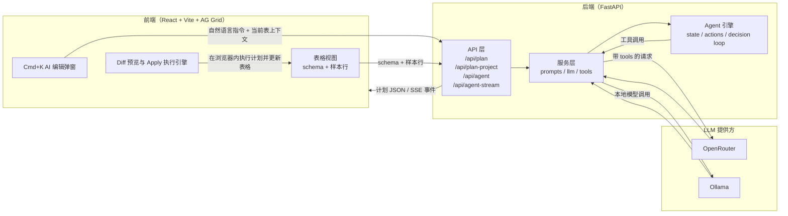

# Cursor for Spreadsheet — MVP

基于 **Cmd+K 式工作流** 的表格编辑 Demo：带上下文的自然语言 → LLM 生成**结构化执行计划** → **Diff 预览** → 一键 **Apply** 写回表格。

## 项目概述

- **性质**：个人持续开发的 side project（非团队交付物）；阶段目标见 [`docs/PRODUCT_BRIEF.md`](docs/PRODUCT_BRIEF.md)，技术细节见 [`docs/`](docs/)。
- **项目名称**：Cursor for Spreadsheet
- **项目描述**：面向表格数据的 AI 增强编辑 Demo，支持通过自然语言生成结构化编辑计划，对多表进行清洗、转换、派生列等操作，并在浏览器端预览并应用变更。
- **技术栈**：
  - 前端：React 18、TypeScript、Vite、AG Grid
  - 后端：Python 3.10+、FastAPI、Uvicorn、httpx、openpyxl
  - LLM / 集成：OpenRouter 或本地 Ollama，通过 HTTP API 进行调用
- **整体架构**：
  - 前端负责表格展示、上下文（schema + 样本行）采集、计划请求发起、Diff 预览与在浏览器内执行计划。
  - 后端提供 `/api/plan`、`/api/plan-project`、`/api/agent`、`/api/agent-stream` 等接口，封装 LLM 调用、提示词与 Agent 流程。
 - Agent 通过多轮 LLM + 工具（读取表结构、样本、列统计与表达式校验等）生成计划，并可在存在歧义时先返回澄清问题。

### 架构图（Mermaid）



## 功能概览

### 已实现（MVP）
1. **Cmd+K「AI 编辑」弹窗**：在任意表格中按下 `Cmd+K`，会展开右侧 AI 面板（若已折叠）并聚焦多行输入框；面板最右侧为纵向图标栏，可在 **AI 对话**、**Schema**、**历史对话** 等视图间切换。
2. **单表计划**（`/api/plan`）：LLM 生成结构化 JSON 计划，前后端共享同一套步骤语义，包括但不限于：
   - 列级操作：`add_column`（新增派生列，支持 `row => row['单价'] * row['数量']` 形式表达式，列名须与 schema 一致）、`transform_column`（trim / lower / upper / replace / parse_date）、`rename_column`、`delete_column`、`reorder_columns`、`cast_column_type` 等。
   - 行级操作：`filter_rows`、`delete_rows`、`deduplicate_rows`、`sort_table`、`fill_missing`（按常数 / 均值 / 中位数 / 众数填充缺失值）等。
3. **多表 / 项目计划**（`/api/plan-project`）：在单表能力基础上，支持典型的多表场景：
   - `join_tables`：按主键/外键进行 inner / left / right join，产出新表。
   - `create_table` / `aggregate_table`：基于现有表创建派生表或聚合表。
   - `union_tables`：将多张结构相近的表纵向合并（严格 / 宽松模式）。
   - `lookup_column`：从维表中按键查找补充列。
4. **Diff 预览（表格内 dry-run + 列高亮）**：
   - 生成计划后，主表格通过本地 `applyProjectPlan` 展示 **dry-run 后的行与 schema**（预览期网格只读，避免与基线数据错位）；计划会 **新建的结果表** 会出现在表标签栏中。
   - 新增列使用浅绿色列头/单元格高亮，修改过的列使用浅黄色高亮，标出本次计划影响的列。
   - 右侧 **Diff Preview** 为简短说明（含变更列名列表）及 Apply / Abort / Revise 按钮；完整 payload / plan / diff JSON 见 **历史记录（技术视图）**。
   - **Apply 成功后** 写回数据并清除 diff 高亮，网格恢复可编辑。
5. **一键 Apply + 撤销**：
   - 生成计划后，可以先在浏览器内预览 Diff，再点击 `Apply` 由后端 `/api/execute-plan` 或项目级 `/api/projects/{id}/execute-plan` 执行完整步骤并写回表格。
   - 每次 Apply 前都会在前端记录快照，工具栏中的「撤销」按钮会将项目恢复到最近一次 Apply 之前的表格状态。
6. **AI 对话与历史**：
   - 右侧 AI 面板通过最右侧 **纵向图标标签** 切换视图：**AI 对话**（气泡式 Chat）、**Schema**（当前表 JSON schema）、**历史对话**（面向开发者的 LLM payload / plan / diff 技术视图）；底部图标为折叠/展开整条侧栏。
   - **AI 对话气泡**：仅保留**本次启动后端期间**的对话。后端进程启动时生成 `serverBootId`（`/health`、`/api/config` 下发）；气泡写入浏览器 `sessionStorage`（键 `spreadsheet-cursor:chat:<serverBootId>:<workspaceKey>`）。同一后端进程内刷新页面可恢复；**重启 uvicorn 后气泡清空**。`ChatMessage.sessionId` 与 `serverBootId` 对齐。
   - **历史记录（技术视图）**：`conversations`（payload / plan / diff）按**工作区键**写入 `localStorage`（`spreadsheet-cursor:workspace:*`）。内置示例 `test-data/sample.xlsx` 使用固定键 `workspace:builtin:sample-xlsx`；用户上传文件按 **SHA-256 文件内容** 生成键 `workspace:file:<hex>`。跨页面刷新与后端重启均可恢复（除非清除站点数据）。每条技术记录附带 `modelTag`（如 `cloud-Auto`）。
   - **模型选择**：云端/本地及具体模型 ID 写入全局 `localStorage`（`spreadsheet-cursor:model-pref`），刷新后恢复；详见 [`docs/client-storage.md`](docs/client-storage.md)。
   - **隐私**：对话与 payload 以明文保存在本机；请勿在共享设备上对敏感表格使用。
   - AI 对话气泡标注时间与模型标签。
7. **Agent 模式（实验性）**：
   - 后端提供 `/api/agent`：基于同一份多表上下文，使用多轮 LLM + 工具（schema / 样本 / 列统计 / 表达式校验等）生成计划，并在遇到歧义时返回「澄清问题」而不是直接执行。
   - 提供 `/api/agent-stream`（SSE）：以流式事件（`tool_call` / `tool_result` / `plan_done` / `finish` / `clarification`）推送 Agent 执行过程，便于前端实时展示「模型在做什么」。
   - **Agent 澄清（clarification）**：
     - **何时触发（当前）**：多表项目且 Plan 含 `add_column` 或 `transform_column` 步骤但未带 `table` 字段时，由规则 `maybe_need_clarification`（`server/app/agent/agent_helpers.py`）在 Plan 产出后拦截并返回澄清，**非** LLM 原生追问。
     - **响应形状**：`kind: "clarification"`，正文含 `clarification.question`、`clarification.options`（常为表名列表）、`clarification.context`；**无** `plan`（字段为 `null` 或省略）。
     - **交互约定（Phase 1 前端）**：用户应**回答澄清**（点选 `options` 或简短回复），而不是把整条 Cmd+K 指令重写一遍；续跑时前端会保留原 `prompt` 并把澄清 Q/A 写入 `history` 再调 `/api/agent`。
     - **计划与测试**：实现路线图见 [`.cursor/plans/agent-clarification-loop.plan.md`](.cursor/plans/agent-clarification-loop.plan.md)；HTTP 映射回归见 `server/tests/test_agent_clarification_route.py`。Cursor 式选项 chips UI 属 Phase 1，尚未落地。
8. **多表 Agent 预览生命周期（可选 `previewLifecycle`）**：
   - **多表 / 项目模式**下，「Generate Plan」走 `/api/agent`，请求体带 `previewLifecycle: true`；有 `projectId` 时服务端从 `ProjectState` 克隆表做 dry-run，无 `projectId` 时需同时传 `previewTables`（全量行）以便服务端在副本上执行计划。
   - 无 `projectId` 时，`previewTables` 每张表最多 **5000** 行：超出部分在前端序列化与后端 `execution_tables_from_execute_tables` 中截断并记 warning，避免超大 JSON 触发反代 body 限制或内存尖峰（常量：`client` 的 `PREVIEW_TABLES_MAX_ROWS_PER_TABLE` 与后端 `PREVIEW_TABLES_MAX_ROWS_PER_TABLE` 须保持一致）。
   - 成功 dry-run 后接口可返回 `kind: "preview_ready"`，正文含紧凑 `preview`（id、四键 `diff`、`newTables`、表指纹等）与 `plan`，**不**在确认前写回已提交数据。
   - 后续决策通过同一 `/api/agent` 提交：`previewDecision: "confirm" | "abort" | "revise"`（配合 `previewId`、`previewHistory`、`commitPlan` 等字段）。`abort` 仅更新预览元数据（标记 `aborted`），表格保持未提交态；`confirm` 在校验表指纹未过期后执行与 dry-run 相同的 `apply_project_plan` 并写回（含项目存储）；`revise` 在轮次上限内携带用户说明重新进入 Agent。
   - **SSE**：`/api/agent-stream` 在 `previewLifecycle: true` 且可解析执行表时，除原有 `plan_done` 外可额外发送 `preview_ready`；dry-run 或 `validate_table` error 级失败时与同步 `/api/agent` 一样在 `MAX_AGENT_PREVIEW_REVISIONS` 内自动修订（重新 `pa_decision_step`），达上限时 `finish.reason` 以 `preview_revision_cap:` 开头；未带该标志时行为与旧版一致。
   - **前端**：存在待处理的服务端预览时，Diff 区域提供 **Apply（确认写回）**、**Abort（放弃预览）**、**Revise（结合输入框说明请求修订）**；单表模式仍使用 `/api/plan` + 本地 Diff 的既有路径。
   - **测试**：后端 `server/tests/test_agent_preview.py`（`uv run pytest tests/test_agent_preview.py`）；前端 `npm test`（Vitest，`src/llm.preview.test.ts`、`src/llm.fetchAbort.test.ts`）。
   - **云端 LLM + 示例表 E2E（可选）**：在 `server/` 目录且已配置 `OPENROUTER_API_KEY` 时，`RUN_CLOUD_LLM_E2E=1 uv run pytest tests/test_cloud_llm_sample_e2e.py -m integration -v` 会调用 OpenRouter 跑一轮 `load-sample` → `/api/plan-project`；未设 `RUN_CLOUD_LLM_E2E=1` 时该用例跳过。可选 `E2E_CLOUD_MODEL_ID` 覆盖云端模型 id。

### 刻意不做（当前范围）
- 协同编辑
- 完整公式引擎 / Excel 兼容
- 多表血缘图
- 外部数据源连接

---

## 环境要求

- **Python 3.10+**（后端）
- **Node.js 18+**（前端构建）

---

## 快速开始

下面是一套可以**从零环境直接照着做**的启动步骤，涵盖云端 OpenRouter 与本地 Ollama 两种模型来源。

### 步骤 0：克隆项目并准备基础环境

1. 确认本机已安装：
   - **Python 3.10+**：在终端执行 `python3 --version` 检查（`uv` 也可按需下载并管理解释器）。
   - **[uv](https://docs.astral.sh/uv/)**（推荐）：用于锁定并安装后端依赖；若尚未安装，可参考官方文档或使用 `curl -LsSf https://astral.sh/uv/install.sh | sh`。
   - **Node.js 18+**：在终端执行 `node -v` 检查。
2. 克隆仓库并进入根目录：

```bash
git clone <your-repo-url> spreadsheet-cursor-mvp
cd spreadsheet-cursor-mvp
```

> 后端依赖由 `uv` 管理：在 `server` 目录执行 `uv sync` 后，会在 `server/.venv` 下创建虚拟环境并安装 `pyproject.toml` / `uv.lock` 中的依赖。

> 环境约定（重要）：本项目后端仅使用 `server/.venv`（由 `uv sync` 在 `server/` 下创建）。请勿将仓库根目录 `env/`、`.venv` 或 `venv` 作为本项目标准运行环境。
>
> 若你本机默认 `python` 来自 Conda，但希望后端环境完全脱离 Conda，可先安装独立 Python（python.org / Homebrew），再在 `server/` 下执行 `uv python pin 3.11`（或指定 `UV_PYTHON`）后重新 `uv sync`。

### 步骤 1：准备 LLM（云端 OpenRouter 或本地 Ollama）

你可以只用云端、只用本地，或者两者都配置好，在前端界面中随时切换。

- **云端（OpenRouter）**：
  1. 访问 [OpenRouter 官网](https://openrouter.ai) 注册账号，并在控制台中新建一个 API Key。
  2. 将该 Key 稍后写入 `server/.env` 中的 `OPENROUTER_API_KEY`。
  3. **云端调试模型建议**：默认下拉含 Auto、三档「经济」模型（Gemini Lite、GPT-4o mini、DeepSeek）与两档「标准」模型（Claude 3.5、Gemini 2.0 Flash）。反复调试 Plan / Agent 时优先选带「经济」标签的项以降低单次调用费用；需要对比效果时再切标准档。默认 `OPENROUTER_MODEL` 仍为 `openrouter/auto`，不影响首次体验。
  4. 可选云端 E2E（需 Key，会真实调用 OpenRouter）：

  ```bash
  cd server
  RUN_CLOUD_LLM_E2E=1 E2E_CLOUD_MODEL_ID=google/gemini-2.5-flash-lite uv run pytest tests/test_cloud_llm_sample_e2e.py -q
  ```
- **本地（Ollama，本机推理）**：
  1. 访问 [Ollama 官网](https://ollama.ai) 根据系统下载并安装 Ollama 客户端。
  2. 安装完成后，在终端执行：

  ```bash
  # 启动服务进程（保持该终端不要关闭）
  ollama serve

  # 拉取本项目默认使用的示例模型
  ollama pull qwen2.5:7b
  ```

  3. Ollama 默认监听在 `http://localhost:11434`，与 `server/app/config.py` 中的默认配置一致；如需修改端口，可在 `server/.env` 中调整 `OLLAMA_BASE`。
  4. 若使用本地 Ollama，建议关闭本机 VPN 或将 `localhost:11434` 加入直连列表，避免被代理导致 503。

> 一般推荐：开发调试时优先使用本地 Ollama，正式对比效果时再切换到云端模型。

### 步骤 2：配置并启动后端（FastAPI）

1. 进入后端目录并复制环境文件：

```bash
cd server
cp .env.example .env
```

2. 编辑 `server/.env`（任意文本编辑器打开），根据自己的需求至少确认以下几项：
   - `OPENROUTER_API_KEY`：如果要使用云端模型，请填入在 OpenRouter 控制台生成的 Key；若只打算使用本地模型，可以留空。
   - `OPENROUTER_MODELS` / `OPENROUTER_LABELS`：可选，用于配置在前端下拉框中展示的云端模型列表及名称（逗号分隔，条数需对齐）。若你已有 `server/.env` 且仍看到旧的 3 项列表，请合并或删除这两项以采用代码或 `.env.example` 中的新默认。
   - `OLLAMA_BASE`：本地 Ollama 服务地址，默认 `http://localhost:11434` 即可。
   - `OLLAMA_MODEL` / `OLLAMA_MODELS` / `OLLAMA_LABELS`：本地模型及其在前端的展示名称，默认使用 `qwen2.5:7b`。
   - `AUTO_START_OLLAMA`：如设为 `1` / `true` / `yes`，后端在启动时会尝试自动执行 `ollama serve`；仍建议你提前在本机安装好 Ollama 与模型。
   - `AGENT_TRANSCRIPTS_DIR`（可选）：若配置为某个本地目录路径，Agent 对话过程会以 JSONL 形式落盘，便于后续分析。

3. 安装后端依赖并启动服务：

```bash
uv sync
uv run uvicorn main:app --reload --port 8787
```

   若希望手动激活虚拟环境，可执行 `source .venv/bin/activate`（Windows 为 `.venv\Scripts\activate`），再运行 `uvicorn main:app --reload --port 8787`。

4. 启动成功后，可以在浏览器访问 `http://localhost:8787/api/config` 或 `http://localhost:8787/docs`，确认接口正常。
   - 如果调用云端模型但未配置 `OPENROUTER_API_KEY`，`/api/plan` 会返回带 `[400]` 前缀的参数错误。
   - 如果 OpenRouter Key 无效或已过期，后端会返回 `[502]` 开头的错误，前端状态栏会显示「云端 LLM 鉴权失败」的中文提示，便于排查。
   - `/api/config` 会返回 `llmUpstreamMaxTimeoutSeconds` 与 `llmClientTimeoutRecommendedMs`：前端在成功拉取配置后，对 `/api/plan`、`/api/agent` 等 LLM 请求使用该推荐毫秒超时（与后端上游 HTTP 超时 + 缓冲对齐）；在配置返回前使用与后端默认一致的回退值（当前为 150s）。
   - **云端 LLM 稳定性（已落地）**：上游 `httpx` 超时/连接/JSON 解析失败映射为稳定 HTTP 错误（避免裸 500）；OpenRouter 响应体缺 `choices`/`content` 时显式失败；对 429/503 等可重试错误有限次指数退避；`previewTables` 行数上限与前端 `AbortSignal` 合并取消 in-flight 请求；Plan 系统提示词使用 compact JSON Schema（无缩进、去掉 description/title），后端仍以 `Plan.model_validate` 为硬校验门；进程级共享 `httpx.AsyncClient` 连接池、SSE 与同步预览修订对齐、malformed tool arguments 重试或 `invalid_tool_arguments` finish。详见 [`.cursor/plans/cloud_llm_roi_fixes_c3a77a21.plan.md`](.cursor/plans/cloud_llm_roi_fixes_c3a77a21.plan.md)。

### 步骤 3：启动前端（Vite + React）

1. 新开一个终端窗口/标签页，进入前端目录并安装依赖：

```bash
cd client
npm install
npm run dev
```

2. 看到 Vite 输出地址后，在浏览器中访问（通常为 `http://localhost:5173`）。首次进入页面时：
   - 顶部标题栏、工具栏与表标签使用 [Bootstrap Icons](https://icons.getbootstrap.com/)（字体/CSS，`bootstrap-icons`），例如快捷键提示、撤销、格式化与导入/导出、「加载示例」时的文件夹图标以及加载中的旋转图标。
   - 顶部状态栏会显示「正在加载示例…」，前端会调用后端 `/api/load-sample` 从 `test-data/sample.xlsx` 中加载多张示例表（精简版：三张表共约 25 行，覆盖多列/去重/日期过滤/跨表 lookup 等场景，并降低 LLM 上下文体积）。需要改示例数据时可运行 `server/.venv/bin/python scripts/build_sample_xlsx.py` 重新生成该文件。
   - 如果后端尚未就绪或加载失败，会显示失败信息，并在右侧提供「加载示例」按钮，稍后可重试。

### 步骤 4：第一次体验 Cmd+K AI 表格编辑

1. 确认前后端都已启动，且页面右上角状态栏不再显示后端错误。
2. 在主表格区域中，可以直接编辑示例数据，或通过顶部工具栏的「导入文件」按钮上传自己的 Excel / CSV 文件：
   - 导入时前端会提示「正在导入文件…（若超过 20 秒仍未完成，请检查文件大小或后端日志）」；
   - 导入成功后，页面会切换到新项目，右上角状态与表列表会一并更新。
3. 按下 `Cmd+K`（Windows/Linux 为 `Ctrl+K`）：若侧栏已折叠会先展开并切到 **AI 对话**，随后光标自动聚焦多行输入框。
4. 在 **AI 对话** 视图中：
   - 在「云端 / 本地」开关中选择当前希望使用的模型来源；
   - 在下拉框中选择具体模型（例如云端「Gemini Lite（经济）」或「Claude 3.5（标准）」，或本地的 `qwen2.5:7b`）。
5. 输入自然语言指令（与 load-sample 示例表列名一致），例如：
   - `在销售订单表新增金额列 = 数量 * 单价`
   - `清洗销售订单的客户列首尾空格，并将订单日期解析为日期`
   - `从产品信息 lookup 类别到销售订单（产品 ↔ 产品名称）`
   - 更多已验证示例见 [`test-data/test-prompts.md`](test-data/test-prompts.md)
6. 点击 `Generate Plan`，等待几秒：
   - 右侧 **AI 对话** 气泡中会出现你刚才的指令，以及一条由系统自动生成的 Plan 摘要回复；
   - 主表格会展示 dry-run 后的预览数据（含新建表 tab）；相关列以绿色/黄色高亮；
   - 下方 **Diff Preview** 显示简短说明、变更列名及「将新建表: ...」等提示（详细 JSON 见 **历史记录** 标签）。
7. 如对计划结果满意，点击 `Apply`：
   - 后端会通过 `/api/execute-plan` 或项目级 `/api/projects/{id}/execute-plan` 执行 Plan 中的全部步骤；
   - 前端会刷新所有表格数据，并在顶部状态栏提示「Applied by backend」。
8. 如发现执行结果不符合预期，可以点击工具栏左侧的「撤销」按钮，将项目恢复到上一次 Apply 之前的状态，然后继续调整指令或 Prompt。

---

## 日志与排查

前后端均在**控制台**输出结构化日志，便于对照同一次用户操作。

### 标识符

| 字段 | 位置 | 说明 |
|------|------|------|
| `sessionId` | 前端 `[APP]` 日志 | 页面加载时生成，标识浏览器 tab（与 AI 气泡的 `serverBootId` 无关）。 |
| `serverBootId` | `/health`、`/api/config`、气泡 `ChatMessage.sessionId` | 单次 uvicorn/FastAPI 进程启动 ID。 |
| `traceId` / `X-Request-ID` | 前端日志 + 请求头 + 后端 `[trace=…]` | 单次 HTTP 请求级 ID；前端在 `cmdk_prompt_submit`、`plan_apply_click` 等事件中与 `request_*` 日志共用同一 `traceId`。 |

### 前端（浏览器开发者工具 → Console）

- 前缀为 **`[APP]`**，字段包含 `level`、`event`、`sessionId`、`ts` 及事件附加属性。
- 常见事件：`app_open`、`sample_load_auto`、`cmdk_open`、`cmdk_prompt_submit`、`request_start` / `request_success` / `request_error`、`plan_response`、`diff_preview_shown`、`plan_apply_click`、`plan_apply_success` / `plan_apply_error`、导入/导出相关事件等。
- **开发环境**默认输出 `info`；生产构建默认仅保证 `error` 仍会输出。可在 `.env` 中为前端设置 `VITE_ENABLE_CONSOLE_LOG=0` 关闭开发态 `info`/`debug`。

### 后端（运行 uvicorn 的终端）

- 在 `server/` 下通过环境变量 **`LOG_LEVEL`**（默认 `INFO`）控制级别；`DEBUG` 时可见 `plan_executor` 逐步骤日志。
- 每条日志含 **`[trace=<id>]`**：来自请求头 `X-Request-ID`（前端传入或中间件生成），与浏览器控制台中的 `traceId` 一致时可串联全链路。
- **`LOG_FULL_TRACEBACK`**：默认开启未捕获异常的完整栈；设为 `0`/`false` 可仅记录简短错误行。
- 关键 logger 命名空间：`spreadsheet.http`（请求起止）、`spreadsheet.api.plan` / `agent` / `load` / `export`、`spreadsheet.services.llm` / `tools` / `projects` / `plan_executor`、`spreadsheet.agent.pa_decision` / `orchestrator` 等。

### SQLite 请求审计（默认开启）

在 `server/.env` 中可通过 **`AUDIT_DB_ENABLED`**（默认 `1`）控制是否把每次 HTTP API 与上游 LLM 调用写入本地 SQLite（默认路径 **`data/audit.sqlite3`**，相对于 `server/` 目录）。与浏览器端的对话/工作区历史（`localStorage` / `sessionStorage`）是两套系统：审计库是开发排障用的事实记录，**不会**注入 Agent prompt。

- 表 **`http_request_logs`** / **`llm_call_logs`** 通过同一 **`trace_id`**（`X-Request-ID`）关联；Agent PA 单轮记为 `call_kind=pa_turn`。
- **`AUDIT_MAX_BODY_CHARS`**（默认 `50000`）截断请求/响应与 message 体积；`/api/import-file`、`/api/export-excel` 与 `/api/agent-stream`（SSE）仅记 metadata。
- 可选请求头：`X-Session-ID`、`X-Model-Tag`；`X-Workspace-Key` 若发送则只存 SHA-256 hash。
- **隐私**：库内可能含表格样本与用户 prompt；`server/data/` 已在 `.gitignore` 中忽略，请勿提交或外传。

### LLM 本地调试日志（可选 NDJSON）

在 `server/.env` 中设置 **`LLM_DEBUG_LOG_DIR`**（例如 `logs/llm-debug`，相对仓库根目录或绝对路径）后，每次上游 LLM 调用（OpenRouter / Ollama）会在该目录下按 UTC 日期与 **`trace_id`** 追加一行 JSON（在启用审计 DB 时，LLM 调用会**先**写 SQLite，再按需写 NDJSON）：

`logs/llm-debug/2026-05-18/<trace_id>.jsonl`

- 与控制台 `[trace=…]`、前端请求头 **`X-Request-ID`** 使用同一 ID，便于对照 Network 面板与后端 stdout。
- 每行含：时间戳、`call`（`plain` / `with_tools`）、模型、`duration_ms`、截断后的 `messages`、成功时的 `result` 或失败时的 `error`（不含 API Key）。
- 可选 **`LLM_DEBUG_MAX_CHARS`**（默认 `50000`）限制单条 message 内文本长度。
- 未设置 `LLM_DEBUG_LOG_DIR` 时完全禁用，无额外开销。
- **隐私**：日志含用户 prompt 与表格上下文片段，仅用于本机调试；`logs/` 已在 `.gitignore` 中忽略，请勿提交。

### 典型排查步骤

1. 复现问题后，在浏览器控制台找到 **`cmdk_prompt_submit`**（或对应 **`request_error`**）中的 **`traceId`**。
2. 在后端终端中搜索同一字符串（或 `grep trace=<id>`）。
3. 根据时间顺序查看：`request start` → `llm call` / `plan_request` → `request end` 与业务错误日志。

技术参考见 [`docs/README.md`](docs/README.md)（Plan Step 类型、架构、Agent 预览、浏览器存储）；Agent 记忆契约见 [`docs/agent-memory.md`](docs/agent-memory.md)；Agent 预览摘要见上文 § Agent 预览生命周期；云端 LLM backlog 见 [`.cursor/plans/cloud_llm_roi_fixes_c3a77a21.plan.md`](.cursor/plans/cloud_llm_roi_fixes_c3a77a21.plan.md)；计划索引见 [`.cursor/plans/INDEX.md`](.cursor/plans/INDEX.md)。

---

## 示例提示词

以下示例与 **`/api/load-sample`** 加载的 [`test-data/sample.xlsx`](test-data/sample.xlsx) 列名一致（工作表：`销售订单`、`产品信息`、`部门预算`）。完整场景见 [`test-data/test-prompts.md`](test-data/test-prompts.md)。

- 在`销售订单`表：将`数量`、`单价`转为数值；新增`金额`=`数量 * 单价`；只保留`订单日期`在 2024 年的行；按`金额`降序排序
- 在`销售订单`表：清洗`客户`列首尾空格；将`订单日期`解析为日期；按`订单号`去重保留首行
- 在`部门预算`表：新增`使用率`=`已使用 / 年度预算`；新增`预算状态`（紧张/正常/宽松）；按`使用率`降序排序
- 基于`销售订单`和`产品信息`：按`产品`与`产品名称` lookup `类别`、`成本价`；在订单表新增`金额`和`毛利`；创建`按类别汇总`并聚合销量与销售额

---

## 架构简述

1. **前端**：收集当前表 schema、若干样本行、可选选区，发起计划请求。
2. **后端**：
   - 对于 `/api/plan` / `/api/plan-project`：用 LLM 直接生成**仅含 JSON** 的执行计划（`intent` + `steps[]`）。
   - 对于 `/api/agent` / `/api/agent-stream`：额外携带历史对话与已应用计划摘要，由 Agent 多轮调用 LLM 与工具，必要时先向用户发起「澄清」再给出计划。
3. **前端**：校验计划、渲染 Diff，Apply 时在浏览器内运行内置的转换引擎执行步骤（包括 Agent 产出的计划）。

### 后端结构（server）

- **`app/`**：FastAPI 应用
  - `api/routes/`：
    - `plan`：单表 / 多表计划（一次调用直接返回 plan）
    - `agent`：Agent 模式，同样的上下文但通过多轮 LLM + 工具生成 plan，可返回澄清问题
    - `agent-stream`：Agent 模式的 SSE 流式版本，推送 tool_call / tool_result / plan_done / finish / clarification 等事件
    - `export`、`health`、`config`
  - `services/`：
    - `prompts`：提示词与 `Message` / `build_messages`
    - `llm`：Ollama / OpenRouter 调用，包含带 tools 的调用 `call_llm_with_tools`
    - `tools`：Agent 可用工具（读 schema / 样本、列统计、表达式校验、分步执行/回滚占位等）
  - `models/`：
    - 计划与请求/响应模型（`PlanRequest` / `ProjectPlanRequest` / `PlanResponse`）
    - Agent 请求模型 `AgentProjectPlanRequest`（在多表请求基础上增加 `history` 与 `appliedPlansSummary`）
  - **`agent/`**：Agent 骨架（状态、动作、决策、循环）
    - `state.py`：`AgentState`（包含 tables、messages、applied_plans_summary、conversation 等）、`TableContext`、`initial_state_from_*`
    - `actions.py`：动作枚举（`call_tool` / `output_plan` / `ask_clarification` / `finish`）及各类 payload
    - `pa_decision.py` / `pa_tools.py` / `llm_pydantic_ai.py`：Pydantic AI 单步决策（structured `Plan` + spreadsheet tools）
    - `agent_helpers.py`：澄清、轮次状态、工具结果写回 `messages`
    - `orchestrator.py`：LangGraph 编排与 `run_agent_orchestrated`（`run_agent_loop` 为别名），`agent_react_step` 供 sync/SSE 共用，`stream_agent_events` 供 `/api/agent-stream`
- **依赖**：`pyproject.toml` + `uv.lock`（`uv sync`）；**入口**：`uv run uvicorn main:app` 或激活 `.venv` 后 `uvicorn main:app`，`main.py` 挂载 `app.main.app`。

---

## 安全与正确性（Demo 说明）

- `add_column` 的表达式通过 `new Function("row", ...)` 在浏览器中执行，**不适合生产**；生产环境应使用沙箱表达式或服务端执行。
- LLM 输出需校验与清洗（当前有 JSON 提取与重试逻辑），不可直接信任。
- **Agent 空回复与校验失败**：`/api/plan*` 经 `call_llm` 时，若 OpenRouter 返回空 `content` 会先重试一次，再失败则 `[502]`。`/api/agent`（PA）若模型发出无效的 `final_result`（Plan 工具参数无法解析/校验），返回 `422` 且 `detail.reason` 以 `plan_validation_failed` 开头；仅当 PA 回合既无工具、无文本、也无 `final_result` 错误时，才为真正的空回合 `422 empty_response`。
- **Agent 多轮 tools 消息形态**：`state.messages` 可含 OpenAI-compatible `dict`（含 `role=tool` / `tool_calls`）；`call_llm` 经 `_messages_with_tools_to_payload` 序列化，普通 chat 路径不传 `tools`。回归见 `server/tests/test_agent_message_shape.py`。

---

## Cursor IDE（本仓库）

在 **Agent 聊天**里用 `/` 可调项目级 slash commands（定义于 [`.cursor/commands/`](.cursor/commands/)）：

| 命令 | 作用 |
|------|------|
| `/dev` | 后台启动 API（8787）+ Vite（5173）并做 health 检查 |
| `/test-backend` | `uv sync`、import smoke、`pytest`（Agent 回归：`uv run pytest tests/test_pa_*.py tests/test_agent_*.py -q`；默认不跑云端 E2E） |
| `/test-client` | `client/` 下 `npm test`（Vitest） |

**Custom subagent**（[`.cursor/agents/spreadsheet-agent-navigator.md`](.cursor/agents/spreadsheet-agent-navigator.md)）：在对话里写例如「用 spreadsheet-agent-navigator 查 preview abort 走哪几个文件」——子代理只读梳理 Agent 栈路径，主对话再改代码。也可在委派 UI 里选该 agent（名称 `spreadsheet-agent-navigator`）。

运行类 skills（`run-project` 等）仍保留作细节参考；日常优先用上表三个 `/` 命令显式触发。

---

## 更多文档

| 类型 | 位置 |
|------|------|
| 环境与快速开始 | 本 README |
| 技术参考（英文） | [`docs/`](docs/) — 索引 [`docs/README.md`](docs/README.md) |
| Cursor 实施计划 / backlog | [`.cursor/plans/INDEX.md`](.cursor/plans/INDEX.md) |
| Cursor slash commands / subagent | 上节 **Cursor IDE（本仓库）** |
| Cursor AI 可见范围 | [`.cursorignore`](.cursorignore)（硬屏蔽）；[`.cursorindexingignore`](.cursorindexingignore)（仅索引）；全局见 **Cursor Settings → indexing** |
| 本地私人笔记（不提交） | `docs/local/`（见 [`.gitignore`](.gitignore)） |

`docs/` 下 canonical 文档随仓库分发；`scripts/` 与 `docs/local/` 默认 gitignore。

**活跃计划示例**： [Cloud LLM ROI fixes](.cursor/plans/cloud_llm_roi_fixes_c3a77a21.plan.md)、[Product roadmap](.cursor/plans/spreadsheet-cursor-roadmap_66f6c3b6.plan.md)、[LangGraph + Pydantic AI（远期）](.cursor/plans/langgraph-pydantic-ai-migration.plan.md)。
