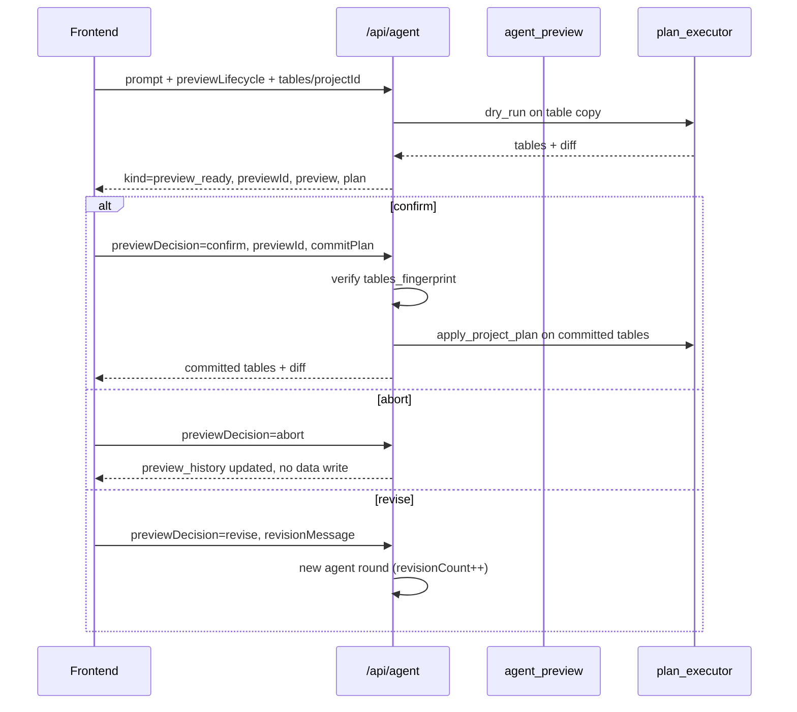

# Agent preview lifecycle

Server-side preview lets the user inspect a plan’s effect on **copied** tables before writing back committed data. Enabled with `previewLifecycle: true` on `AgentProjectPlanRequest` (`POST /api/agent` or `/api/agent-stream`).

**Wire JSON:** `preview_ready` responses and embedded `PreviewRecord.plan` use the public Plan field aliases (`from` on lookup mappings, `as` on aggregations), aligned with [plan-step-types-reference.md](./plan-step-types-reference.md). The backend serializes via `plan_to_wire_dict` / `preview_record_to_wire_dict` in `server/app/models/plan.py` (not Python-internal `from_` / `as_` keys).

## States

| `PreviewRecord.status` | Meaning |
|------------------------|---------|
| `pending` | Dry-run succeeded; awaiting user decision |
| `aborted` | User chose Abort; no commit |
| `committed` | User confirmed; plan applied to submitted tables |
| `revised` | User chose Revise; new agent round with feedback |

## Request flow

## Execution table resolution

| Request fields | Execution tables source |
|----------------|-------------------------|
| `projectId` set | Clone from `ProjectState` in memory store |
| No `projectId`, `previewTables` set | `execution_tables_from_execute_tables(previewTables)` |
| Neither | Preview lifecycle cannot dry-run (falls back to legacy plan-only response) |

## Row cap

`PREVIEW_TABLES_MAX_ROWS_PER_TABLE = 5000` (must match in `client/src/llm.ts` and `server/app/services/agent_preview.py`). Excess rows are truncated with a server warning log.

## Fingerprint (staleness check)

On preview creation, `tables_fingerprint_at_preview` is a composite `{structure_hash}:{content_hash}`:

- **Structure**: per table — name, row count, schema column keys
- **Content**: per table — up to `PREVIEW_TABLES_MAX_ROWS_PER_TABLE` rows of cell values (stable JSON key order)

On **confirm**, if the committed tables’ fingerprint differs, the API returns HTTP 409 with `reason: "stale_preview"` and `staleReason: "structure" | "content"` (structure hash mismatch vs content-only drift).

## Revision limit

`MAX_AGENT_PREVIEW_REVISIONS = 5` (`server/app/services/agent_preview.py`). Exceeding auto-revise loops returns HTTP 429 from the agent route.

## SSE events

With `previewLifecycle: true`, `/api/agent-stream` emits `preview_ready` (with `plan`, `preview`, `previewHistory`) followed by `plan_done` (same plan wire dict). Tool steps emit `tool_call` / `tool_result` pairs before the terminal events.

Full event contract, ordering rules, and sync/SSE parity: [agent-stream-sse.md](./agent-stream-sse.md).

## Key request fields (`AgentProjectPlanRequest`)

| Field | Purpose |
|-------|---------|
| `previewLifecycle` | Enable server dry-run + preview response |
| `previewDecision` | `confirm` \| `abort` \| `revise` |
| `previewId` | Targets a pending preview |
| `previewHistory` | Compact prior preview records |
| `revisionMessage` | User text for revise |
| `revisionCount` | Server/client revision counter |
| `commitPlan` | Plan to apply on confirm (may match preview plan) |
| `lastExecutionError` | Feed execution failures back into agent |

## Tests

- Backend: `server/tests/test_agent_preview.py`
- Frontend: `client/src/llm.preview.test.ts`, `llm.fetchAbort.test.ts`
- Optional cloud E2E: `server/tests/test_cloud_llm_sample_e2e.py` (requires `OPENROUTER_API_KEY`, `RUN_CLOUD_LLM_E2E=1`)
