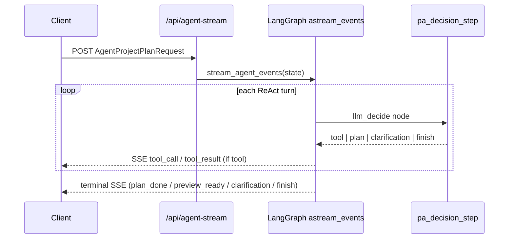

# Agent SSE streaming (`/api/agent-stream`)

`POST /api/agent-stream` exposes the same LangGraph orchestrator as sync `POST /api/agent`, but emits **Server-Sent Events** as the ReAct loop runs. Use it when the UI should show tool-call progress or when you want parity testing against the sync path without blocking on the full round trip.

**Related:** preview confirm/abort/revise and table fingerprints are documented in [agent-preview-lifecycle.md](./agent-preview-lifecycle.md). Workspace memory and `history` assembly live in [agent-memory.md](./agent-memory.md).

## When to use sync vs stream

| Path | Endpoint | Response | Typical use |
|------|----------|----------|-------------|
| Sync | `POST /api/agent` | Single JSON body (`plan`, `preview_ready`, `clarification`, or HTTP error) | Default production path in `App.tsx` |
| Stream | `POST /api/agent-stream` | `text/event-stream` until a terminal event | Opt-in via `VITE_AGENT_USE_STREAM=true`; dev tooling (`window.__spreadsheetCursorConsumeAgentStream`) |

Both accept the **same request body** (`AgentProjectPlanRequest`). The client builds it with `buildAgentProjectPlanRequestBody` in `client/src/llm.ts`.

Preview **decision** requests (`previewDecision: confirm | abort | revise`) are handled only on the sync route today — they do not stream.

## Implementation sketch



- **Sync:** `run_agent_orchestrated` → `_map_agent_result_to_response` (`server/app/api/routes/agent.py`).
- **Stream:** `stream_agent_events` (`server/app/agent/orchestrator.py`) drives LangGraph `astream_events(..., version="v2")` and maps `llm_decide` / `tool_exec` chain ends to SSE chunks.
- **Shared ReAct step:** `agent_react_step` delegates to `pa_decision_step` for both paths.

Context and intent analyzers (`analyze_context`, `analyze_intent`) run on every graph invocation for sync and stream alike.

## SSE wire format

Each event is a standard SSE block:

```
event: <kind>
data: <JSON object>

```

`Content-Type: text/event-stream`. Payloads use wire Plan aliases (`from`, `as`) via `plan_to_wire_dict` / `preview_record_to_wire_dict`.

## Event kinds

| `event` | When | Terminal? |
|---------|------|-----------|
| `tool_call` | PA chose a spreadsheet tool | No |
| `tool_result` | Tool execution finished | No |
| `plan_done` | Valid Plan returned (no preview lifecycle, or after `preview_ready`) | Yes |
| `preview_ready` | `previewLifecycle: true` and dry-run succeeded | Yes (always followed by `plan_done`) |
| `clarification` | `ask_user` or deterministic gate | Yes |
| `finish` | Error cap, max turns, or non-plan terminal | Yes |

### `tool_call` data

| Field | Type | Notes |
|-------|------|-------|
| `tool` | string | e.g. `get_table_schema` |
| `args` | object | Tool arguments |
| `state` | object | `AgentState.to_dict()` snapshot (truncated messages) |

### `tool_result` data

| Field | Type | Notes |
|-------|------|-------|
| `tool` | string | Matches preceding `tool_call` |
| `state` | object | Updated `AgentState` after tool messages appended |

### `plan_done` data

| Field | Type | Notes |
|-------|------|-------|
| `plan` | object | Wire Plan JSON |
| `state` | object | Final agent state |

Sync equivalent: `PlanResponse` (`{ "plan": … }`) from `_map_agent_result_to_response` when action is `output_plan` and preview lifecycle is off.

### `preview_ready` data

| Field | Type | Notes |
|-------|------|-------|
| `plan` | object | Wire Plan JSON |
| `preview` | object | `PreviewRecord` (status `pending`, includes `tables_fingerprint_at_preview`) |
| `previewHistory` | array | Full history including the new pending record |
| `state` | object | Agent state with updated `preview_history` |

Sync equivalent: JSON `{ kind: "preview_ready", plan, preview, previewHistory, state }` — same top-level keys as the SSE `preview_ready` data object (parity tested in `server/tests/test_agent_sync_order.py`).

When preview lifecycle is on, the stream emits **`preview_ready` then `plan_done`** (both carry the plan; clients should treat `preview_ready` as the authoritative preview payload).

### `clarification` data

| Field | Type | Notes |
|-------|------|-------|
| `question` | string | |
| `options` | string[] \| null | Optional choices |
| `context` | string \| null | Why clarification was needed |
| `state` | object | Agent state |

Sync equivalent: `{ kind: "clarification", plan: null, clarification: { question, options, context } }`.

### `finish` data

| Field | Type | Notes |
|-------|------|-------|
| `reason` | string | e.g. `max_turns`, `preview_revision_cap`, `llm_error:…`, `internal_orchestrator_state` |
| `state` | object | Agent state at termination |

Sync maps many `finish` reasons to HTTP **422** with `{ kind: "error", reason }` (or 400/502 for embedded LLM errors). The stream client (`mapAgentStreamEventsToResult`) throws `Error: agent-stream finish: <reason>`.

## Ordering guarantees

Enforced by `server/tests/test_agent_stream_sse_order.py`:

1. Every `tool_result` follows a matching `tool_call` (same `tool` name); no nested `tool_call` without `tool_result`.
2. **At most one terminal family** per stream, except the `preview_ready` + `plan_done` pair.
3. If `preview_ready` appears, it is immediately followed by `plan_done` (or ends the stream).

## Frontend integration

| Module | Role |
|--------|------|
| `client/src/agentStream.ts` | `consumeAgentStream` — fetch + SSE parser; optional `onEvent` / `onClarification` hooks |
| `client/src/agentProjectPlan.ts` | `requestAgentProjectPlanViaStream` + `mapAgentStreamEventsToResult` → same `AgentProjectPlanResult` as sync |
| `client/src/llm.ts` | `requestAgentProjectPlan` (sync), shared request body builder |
| `client/src/App.tsx` | Uses stream when `import.meta.env.VITE_AGENT_USE_STREAM === "true"` |

Terminal mapping priority in `mapAgentStreamEventsToResult` (last wins): `clarification` → `preview_ready` → `plan_done` → `finish` (throws).

Dev globals (for manual testing in the browser console):

- `window.__spreadsheetCursorConsumeAgentStream`
- `window.__spreadsheetCursorBuildClarificationHistoryEntry`

## Observability

- Frontend: `agent_stream_fetch_failed`, `agent_stream_clarification`, `agent_stream_done` (`client/src/agentStream.ts`).
- Audit middleware logs `/api/agent-stream` bodies as metadata-only when large (`AUDIT_MAX_BODY_CHARS`); see [logging-and-debug.md](./logging-and-debug.md).
- Correlate with `X-Request-ID` / `traceId` like any other Agent call.

## Tests

| File | Covers |
|------|--------|
| `server/tests/test_agent_stream_sse_order.py` | Event ordering, PA routing |
| `server/tests/test_agent_sync_order.py` | Sync/SSE `preview_ready` payload parity, shared analyzers |
| `server/tests/test_agent_orchestrator_preview.py` | Preview revision loops (sync + stream) |
| `client/src/agentProjectPlan.test.ts` | Stream → `AgentProjectPlanResult` mapping |
| `client/src/llm.preview.test.ts` | Preview + fingerprint client paths |
