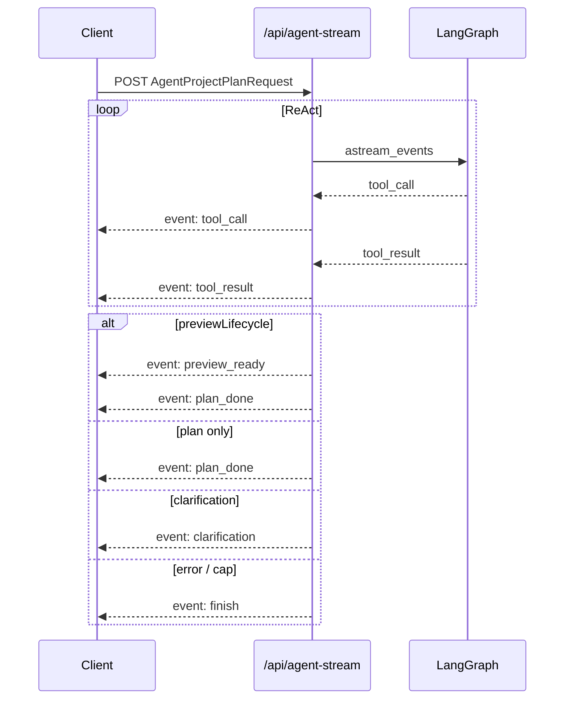

# Agent SSE stream (`/api/agent-stream`)

Server-Sent Events (SSE) variant of the Agent endpoint. The request body is identical to `POST /api/agent` (`AgentProjectPlanRequest`); only the response shape differs — a stream of named events instead of one JSON body.

**Sync parity:** Both paths run the same LangGraph orchestrator (`run_agent_orchestrated` / `stream_agent_events` in `server/app/agent/orchestrator.py`). Terminal payloads for `preview_ready` and `clarification` match the sync route's `_map_agent_result_to_response` fields. See `server/tests/test_agent_sync_order.py`.

## When to use

| Path | Use when |
|------|----------|
| `POST /api/agent` | Default UI path; one-shot JSON response |
| `POST /api/agent-stream` | Live tool-step visibility; optional frontend flag `VITE_AGENT_USE_STREAM=true` in `App.tsx` |

Both share `buildAgentProjectPlanRequestBody` on the client (`client/src/llm.ts`).

## Event types

| `event:` name | Role | Terminal? |
|---------------|------|-----------|
| `tool_call` | PA chose a spreadsheet tool | No |
| `tool_result` | Tool execution finished | No |
| `preview_ready` | Dry-run succeeded (`previewLifecycle: true`) | Yes* |
| `plan_done` | Valid Plan JSON ready | Yes |
| `clarification` | User input needed (`ask_user` or post-plan gate surfaced as clarification) | Yes |
| `finish` | Loop ended without a plan (max turns, cap, internal error) | Yes |

\*When `previewLifecycle: true` and execution tables resolve, the stream emits **`preview_ready` then `plan_done`** (same plan wire dict in both). Clients that only need the preview should treat `preview_ready` as terminal; `mapAgentStreamEventsToResult` in `client/src/agentProjectPlan.ts` prefers `clarification` → `preview_ready` → `plan_done` → `finish`.

## Ordering guarantees

Verified in `server/tests/test_agent_stream_sse_order.py`:

1. Every `tool_result` immediately follows its matching `tool_call` (same `tool` name); no nested `tool_call` without a result.
2. At most one terminal outcome per stream, except the `preview_ready` + `plan_done` pair.
3. Intermediate events may repeat (`tool_call` / `tool_result` pairs) until a terminal action.



## Payload shapes (data JSON)

All events include a `state` field (serialized `AgentState`) except where noted.

### `tool_call`

```json
{ "tool": "get_table_schema", "args": { "table": "Sheet1" }, "state": { } }
```

### `tool_result`

```json
{ "tool": "get_table_schema", "state": { } }
```

### `plan_done`

```json
{ "plan": { "intent": "...", "steps": [ ] }, "state": { } }
```

Plan keys use wire aliases (`from`, `as`) via `plan_to_wire_dict`.

### `preview_ready`

Same top-level keys as sync `kind: "preview_ready"`:

```json
{
  "plan": { },
  "preview": { "id": "...", "status": "pending", "tables_fingerprint_at_preview": "struct:content" },
  "previewHistory": [ ],
  "state": { }
}
```

Fingerprint semantics: [agent-preview-lifecycle.md](./agent-preview-lifecycle.md) § Fingerprint.

### `clarification`

```json
{
  "question": "Which sheet?",
  "options": ["Sheet1", "Sheet2"],
  "context": "ambiguous column reference",
  "state": { }
}
```

Sync path wraps the same fields under `kind: "clarification"` + nested `clarification` object.

### `finish`

```json
{ "reason": "max_turns", "state": { } }
```

Common `reason` values: `max_turns`, `preview_revision_cap`, `internal_orchestrator_state`, `user_stop`, `llm_error:…` (sync path may map LLM errors to HTTP 4xx/5xx instead).

## Client modules

| Module | Role |
|--------|------|
| `client/src/agentStream.ts` | Low-level SSE parser (`consumeAgentStream`); terminal kinds listed in `AgentStreamEventKind` |
| `client/src/agentProjectPlan.ts` | Maps event list → `AgentProjectPlanResult` (parity with sync `requestAgentProjectPlan`) |
| `client/src/App.tsx` | `VITE_AGENT_USE_STREAM === "true"` selects stream path |

## Implementation notes

- SSE is produced from LangGraph `astream_events` (`version="v2"`), listening for `on_chain_end` on nodes `llm_decide` and `tool_exec` — not token-level LLM streaming.
- Preview revision loops (dry-run failure → auto-revise) re-enter the graph inside `stream_agent_events`, same as sync `run_agent_orchestrated`.
- Audit middleware logs `/api/agent-stream` as metadata-only when bodies are large (`AUDIT_MAX_BODY_CHARS`); see [logging-and-debug.md](./logging-and-debug.md).

## Tests

| Area | File |
|------|------|
| Event ordering | `server/tests/test_agent_stream_sse_order.py` |
| Sync / SSE preview parity | `server/tests/test_agent_sync_order.py` |
| Preview + SSE wire aliases | `server/tests/test_plan_wire_serialization.py` |
| Client stream mapping | `client/src/agentProjectPlan.test.ts`, `client/src/agentStream.test.ts` |

## Related docs

- [architecture.md](./architecture.md) — Agent decision loop
- [agent-preview-lifecycle.md](./agent-preview-lifecycle.md) — confirm / abort / revise, stale fingerprint
- [agent-memory.md](./agent-memory.md) — `history`, compaction, session sync on Agent requests
- [trouble-shoot.md](./trouble-shoot.md) — common SSE and preview pitfalls
