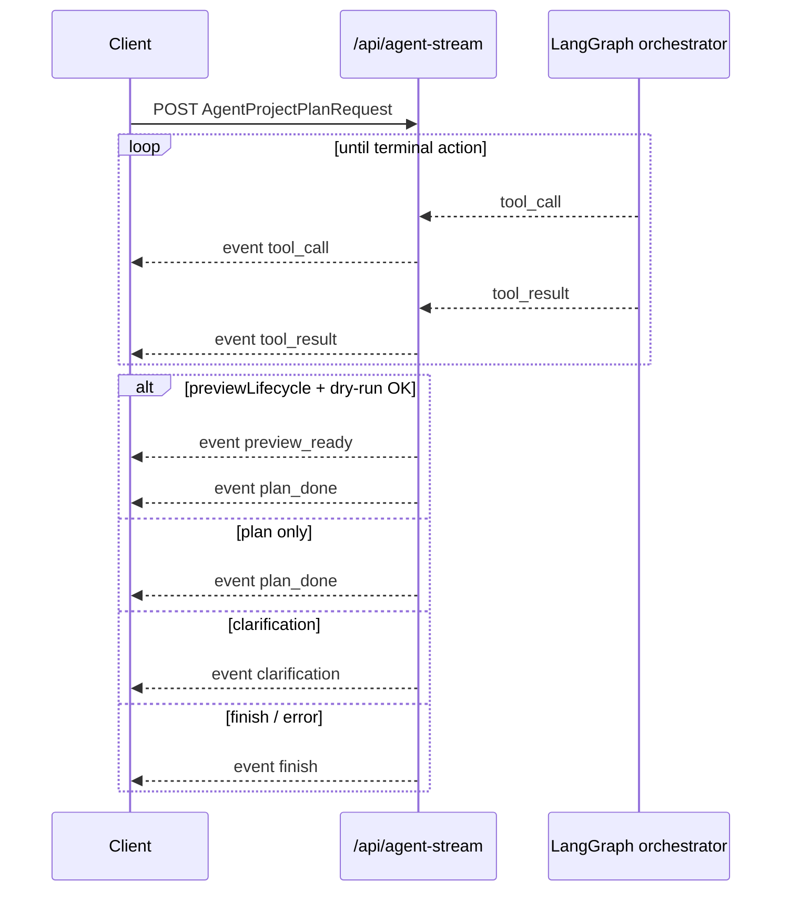

# Agent SSE stream (`/api/agent-stream`)

Server-Sent Events variant of the Agent project-plan loop. The request body is identical to `POST /api/agent` (`AgentProjectPlanRequest`); the response is a `text/event-stream` of incremental events instead of a single JSON body.

**Related:** preview confirm / abort / revise and fingerprint semantics live in [agent-preview-lifecycle.md](./agent-preview-lifecycle.md). Memory and session sync are in [agent-memory.md](./agent-memory.md).

## When to use SSE vs sync

| Path | Use for |
|------|---------|
| `POST /api/agent-stream` | New prompts, clarification follow-ups, preview **generation** — stream `tool_call` / `tool_result` while the graph runs |
| `POST /api/agent` (sync) | Same generation paths **plus** all `previewDecision` flows (`confirm`, `abort`, `revise`) |

The SSE route does **not** implement preview decision shortcuts. `agent_stream` in `server/app/api/routes/agent.py` always enters LangGraph; confirm/abort/revise logic exists only on the sync `/api/agent` handler.

The React client mirrors this: `VITE_AGENT_USE_STREAM=true` routes **generation** through `requestAgentProjectPlanViaStream`; confirm/abort/revise always call `requestAgentProjectPlan` (sync).

## Wire format

Each SSE chunk:

```
event: <name>
data: <json object>

```

`data` is UTF-8 JSON (`ensure_ascii=False` on the server). Every event includes a `state` field with the serialized `AgentState` snapshot after that step (except where noted below).

## Event types

| Event | When emitted | Key `data` fields |
|-------|----------------|-------------------|
| `tool_call` | PA chose a spreadsheet tool | `tool`, `args`, `state` |
| `tool_result` | Tool finished | `tool`, `state` |
| `preview_ready` | `previewLifecycle: true` and dry-run succeeded (or degraded at revision cap) | `plan`, `preview`, `previewHistory`, optional `warnings`, `state` |
| `plan_done` | Terminal plan output | `plan`, `state` |
| `clarification` | Terminal `ask_clarification` | `question`, `options`, `context`, `state` |
| `finish` | Terminal `finish` or orchestrator error | `reason`, `state` |

`plan` and embedded preview records use public wire aliases (`from`, `as`) via `plan_to_wire_dict` / `preview_record_to_wire_dict` — same as sync responses.

## Ordering rules

Verified in `server/tests/test_agent_stream_sse_order.py` and `test_agent_sync_order.py`:

1. **Tool pairs:** every `tool_result` immediately follows its matching `tool_call` (same `tool` name). No nested `tool_call` without an intervening `tool_result`.
2. **One terminal outcome per HTTP request** (after zero or more tool pairs):
   - `clarification` alone, or
   - `finish` alone, or
   - `plan_done` alone (no preview lifecycle), or
   - `preview_ready` then **`plan_done`** (preview lifecycle).
3. **Preview revision loop:** when dry-run fails validation, the orchestrator retries inside an outer `while` loop **without** closing the HTTP stream — only the final successful round emits terminal events.
4. **Context / intent:** SSE and sync both run `analyze_context` and `analyze_intent` on each graph invocation (`test_stream_and_sync_both_invoke_context_intent_analyzers`).



## Terminal events → client result

`client/src/agentProjectPlan.ts` maps the collected event list to the same `AgentProjectPlanResult` shape as sync `/api/agent` (last matching terminal wins):

| Last terminal SSE event | `AgentProjectPlanResult.kind` | Notes |
|-------------------------|-------------------------------|-------|
| `clarification` | `clarification` | Checked before `preview_ready` |
| `preview_ready` | `preview_ready` | Includes `warnings` when present |
| `plan_done` | `plan` | No server preview record |
| `finish` | — | Throws `agent-stream finish: <reason>` |

Sync parity for `preview_ready` payloads (`plan`, `preview`, `previewHistory`, `warnings`) is asserted in `test_sync_and_sse_preview_ready_payload_parity`.

## `finish` reasons (non-exhaustive)

| `reason` | Meaning |
|----------|---------|
| `max_turns` | `current_turn >= max_turns` before a terminal action |
| `user_stop` | Model / graph returned `FinishAction` |
| `preview_revision_cap: …` | Auto-revise at cap with no degradable preview (`PreviewEvaluationCap`) |
| `internal_orchestrator_state` | Graph ended without a deserializable terminal action |
| `llm_error:…` | Upstream LLM failure (sync path maps some to HTTP 4xx/502; SSE emits `finish`) |

At revision cap, prefer **degraded** `preview_ready` with `warnings` so the user can still confirm or abort — see [agent-preview-lifecycle.md § Revision limit](./agent-preview-lifecycle.md#revision-limit). SSE and sync share `evaluate_output_plan_preview` / `resolve_preview_cap_degraded_ready`.

## Frontend integration

| Piece | Role |
|-------|------|
| `client/src/agentStream.ts` | `consumeAgentStream` — POST, incremental SSE parse, `onEvent` / `onClarification` hooks |
| `client/src/agentProjectPlan.ts` | `mapAgentStreamEventsToResult`, `requestAgentProjectPlanViaStream` |
| `client/src/llm.ts` | `buildAgentProjectPlanRequestBody` shared by sync and stream |
| `client/src/App.tsx` | `VITE_AGENT_USE_STREAM === "true"` selects stream for generation only |

Enable streaming in dev:

```bash
# client/.env.local
VITE_AGENT_USE_STREAM=true
```

Console events: `agent_stream_fetch_failed`, `agent_stream_clarification`, `agent_stream_done` (see [logging-and-debug.md](./logging-and-debug.md)).

## Request body (shared with `/api/agent`)

Built by `buildAgentProjectPlanRequestBody` in `client/src/llm.ts`. Common fields:

| Field | SSE relevance |
|-------|----------------|
| `prompt`, `tables`, `history`, `appliedPlansSummary` | Standard agent context |
| `previewLifecycle`, `previewTables` / `projectId` | Enables `preview_ready` events |
| `previewHistory`, `revisionCount` | Preview revision state |
| `clarificationReply`, `clarificationTurnId` | Clarification follow-up |
| `previewDecision` | **Ignored on SSE route** — use sync `/api/agent` |

## Tests

| File | Coverage |
|------|----------|
| `server/tests/test_agent_stream_sse_order.py` | Tool ordering, terminal exclusivity, PA routing |
| `server/tests/test_agent_sync_order.py` | Sync/SSE parity, analyzer invocation, preview payloads |
| `server/tests/test_agent_orchestrator_preview.py` | Preview retry loop, cap degraded `preview_ready` on SSE |
| `server/tests/test_plan_wire_serialization.py` | Wire aliases on `plan_done` / `preview_ready` |
| `client/src/agentStream.test.ts` | SSE chunk parser |
| `client/src/agentProjectPlan.test.ts` | Terminal event → result mapping |

## Source of truth

| Concern | File |
|---------|------|
| SSE emission | `server/app/agent/orchestrator.py` — `stream_agent_events` |
| HTTP route | `server/app/api/routes/agent.py` — `agent_stream`, `_agent_event_stream` |
| Preview evaluation | `server/app/services/agent_preview.py` — `evaluate_output_plan_preview` |
| Client consumer | `client/src/agentStream.ts`, `client/src/agentProjectPlan.ts` |
