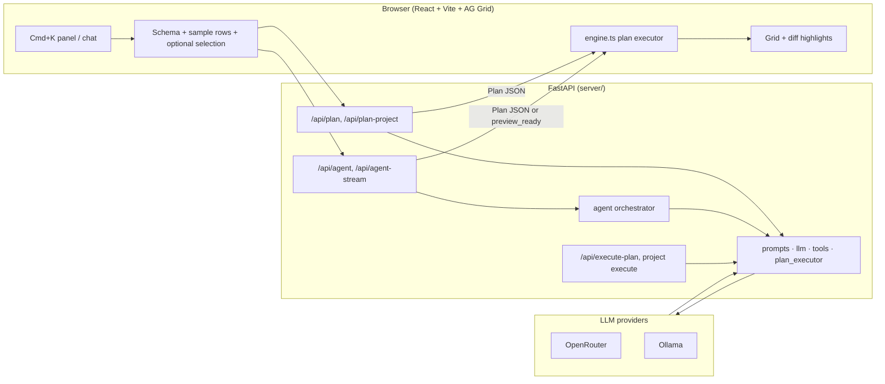

# Architecture overview

Cursor for Spreadsheet is a browser-first MVP: natural language → structured **Plan** JSON → diff preview → apply. The FastAPI backend owns LLM calls and optional server-side plan execution; the React client owns the grid, local preview engine, and most apply paths.

## High-level flow

## Planning modes

| Mode | Endpoint | When used |
|------|----------|-----------|
| Single-table plan | `POST /api/plan` | One sheet; LLM returns plan in one shot |
| Project plan | `POST /api/plan-project` | Multiple tables in request body |
| Agent (sync) | `POST /api/agent` | Multi-turn tools + optional clarification / preview lifecycle |
| Agent (SSE) | `POST /api/agent-stream` | Same as agent with streaming events |

**Single-table UX** often uses `/api/plan` plus **client-side** `applyProjectPlan` for diff preview.

**Multi-table / Agent UX** can set `previewLifecycle: true` on `/api/agent` so the server dry-runs on a copy and returns `preview_ready` before commit. See [agent-preview-lifecycle.md](./agent-preview-lifecycle.md).

## Backend layout (`server/app/`)

| Area | Role |
|------|------|
| `api/routes/plan.py` | Plan generation, project plan by id, execute-plan |
| `api/routes/agent.py` | Agent sync + stream; preview confirm/abort/revise |
| `api/routes/config.py`, `health.py` | Model config, `serverBootId`, health |
| `services/llm.py` | OpenRouter / Ollama HTTP (`call_llm` for plan routes) |
| `services/llm_pydantic_ai.py` | Pydantic AI agent factory (OpenRouter / Ollama) |
| `services/prompt_content.py` | System prompts + Plan JSON Schema injection |
| `services/tools.py` | Agent tools (schema, samples, stats, expression check) |
| `services/plan_executor.py` | Server-side `apply_project_plan` |
| `services/agent_preview.py` | Preview id, fingerprint, dry-run, history |
| `agent/` | `state`, `actions`, `orchestrator` (LangGraph), `pa_decision`, `pa_state`, `pa_tools`, `agent_helpers` |
| `models/plan.py` | Plan / request / response Pydantic models |

Entry: `server/main.py` → `uvicorn main:app` (port **8787** default).

## Frontend layout (`client/src/`)

| Module | Role |
|--------|------|
| `App.tsx` | Shell: grid, side panel, plan/preview/apply UX |
| `llm.ts` | API client, Zod plan parsing, agent + preview requests |
| `engine.ts` | Browser plan executor (parity with server executor) |
| `types.ts` | Plan / Diff / Preview TypeScript types |
| `backendSessionChatStorage.ts` | Chat bubbles per server boot + workspace |
| `workspaceHistoryStorage.ts` | Technical history (payload/plan/diff) in localStorage |

Dev server: Vite port **5173**.

## Agent decision loop (conceptual)

1. Build `AgentState` from request tables, history, applied-plan summary.
2. LangGraph `orchestrator` runs context/intent nodes, then ReAct: `agent_react_step` → `pa_decision_step` (Pydantic AI, `output_type=Plan`, spreadsheet tools via `pa_tools`).
3. Actions: `call_tool` | `output_plan` | `ask_clarification` | `finish` (and preview-specific actions when enabled). Tool results append via `agent_helpers.run_tool_and_append_messages`.
4. Sync `/api/agent` uses the same graph; `/api/agent-stream` mirrors steps as SSE (see [agent-preview-lifecycle.md](./agent-preview-lifecycle.md)).
5. If `previewLifecycle` and execution tables are available, dry-run plan → `PreviewRecord` + compact preview payload.

**Config:** Agent always uses Pydantic AI. Optional debug-only `AGENT_PA_PLAN_JSON_FALLBACK=1` parses assistant text as Plan JSON when structured output is missing (not the production path).

**Plan routes** (`/api/plan`, `/api/plan-project`) still use `call_llm` + JSON extraction — separate from Agent runtime.

Tools never mutate submitted project data directly; execution uses copied `TableData`.

## Observability

- **Trace ID**: `X-Request-ID` / `[trace=…]` in logs; optional NDJSON under `LLM_DEBUG_LOG_DIR` (see README).
- **Frontend**: `cmdk_prompt_submit` / `request_error` console events carry `traceId`.

## Intentional non-goals (MVP)

Collaborative editing, full formula engine, lineage graph, external data connectors.
